# 🏗️ _SUDOTEER Architecture Documentation (v11.1.0+)

## Overview
This document provides a high-level representation of the **_SUDOTEER** ecosystem, a premium forensic and financial intelligence desktop application specialized for industrial greenhouse automation and agricultural intelligence.

---

## 🏛️ System Topology
The following diagram illustrates the relationship between the Electron frontend, the Python Agency backend, the Hybrid Memory system, and the Industrial control layer.

---

## 🧱 Layered Architecture (Base -> Platform -> Workbench)
As defined in the core directive, _SUDOTEER follows a strict layered architecture to ensure isolation and scalability.

```mermaid
architecture-beta
	group workbench(logos:electron)[Workbench Layer]
	service desktop(logos:electron)[SUDOTEER Desktop] in workbench
	service voice(logos:livekit)[LiveKit Voice] in workbench

	group platform(logos:python)[Platform Layer]
	service agency(logos:python)[Agent Agency] in platform
	service dspy(logos:python)[DSPy Engine] in platform
	service bus(logos:python)[Event Bus] in platform

	group base(logos:database)[Base Layer]
	service memory(logos:database)[Hybrid Memory] in base
	service bridge(logos:arduino)[PLC Bridge] in base
	service data(logos:supabase)[Persistence] in base

	desktop:B -- T:agency
	voice:B -- T:agency
	agency:L -- R:dspy
	agency:R -- L:bus
	agency:B -- T:memory
	agency:B -- T:bridge
	memory:B -- T:data
```

---

## 📡 Service Component Definition

| Tier | Component | Responsibility |
| :--- | :--- | :--- |
| **Workbench** | `UI Renderer` | Glassmorphism-based UI, Workflow Visualizer, Digital Twin dash. |
| **Workbench** | `LiveKit Voice` | Real-time voice interaction and agent dialogue. |
| **Platform** | `Agency Middleware` | IPC Management, WebSockets, Command routing to agents. |
| **Platform** | `DSPy Engine` | Intelligent routing and memory splitting optimization. |
| **Platform** | `Orchestrator` | Managing the lifecycle of the 5-Agent team. |
| **Base** | `Hybrid Memory` | 3-Layer router: Semantic (Chroma), Relational (Neo4j), Persistent (Supabase). |
| **Base** | `PLC Bridge` | Industrial protocol translation (MQTT/Modbus/OPC UA). |

---

## 🔄 Data Movement Patterns

### 1. The Command Flow (Top-Down)
1. **Human** interacts with Electron UI or Voice.
2. **Bridge** forwards command to **Web Server** via WebSocket.
3. **Command Server** dispatches to **Orchestrator**.
4. **Architect Agent** decomposes the goal into tasks.
5. **Specialist Agents** (Climate/Coder) execute tasks via tools.

### 2. The Memory Flow (Hybrid)
1. Agent generates a **Thought** or **Fact**.
2. **Memory Manager** receives the observation.
3. **DSPy Splitter** extracts structured relations.
4. Facts go to **Neo4j** (as Nodes/Edges).
5. Narrative goes to **ChromaDB** (as Embeddings).
6. Sync task pushes to **Supabase** for cross-session persistence.

---

## 🛠 Tech Stack (v11.1.0+)
- **Frontend**: Electron, Javascript (Vanilla ES6+), CSS3 (Glassmorphism).
- **Backend**: Python 3.10+, FastAPI, PCSE (Crop Science).
- **Agents**: DSPy, OpenAI/Local LLM (LM Studio/Ollama).
- **Storage**: ChromaDB, Neo4j, Supabase.
- **Communication**: WebSockets, WebRTC (LiveKit).
- **Diagrams**: Mermaid.js v11.1.0+ (Architecture-beta).
