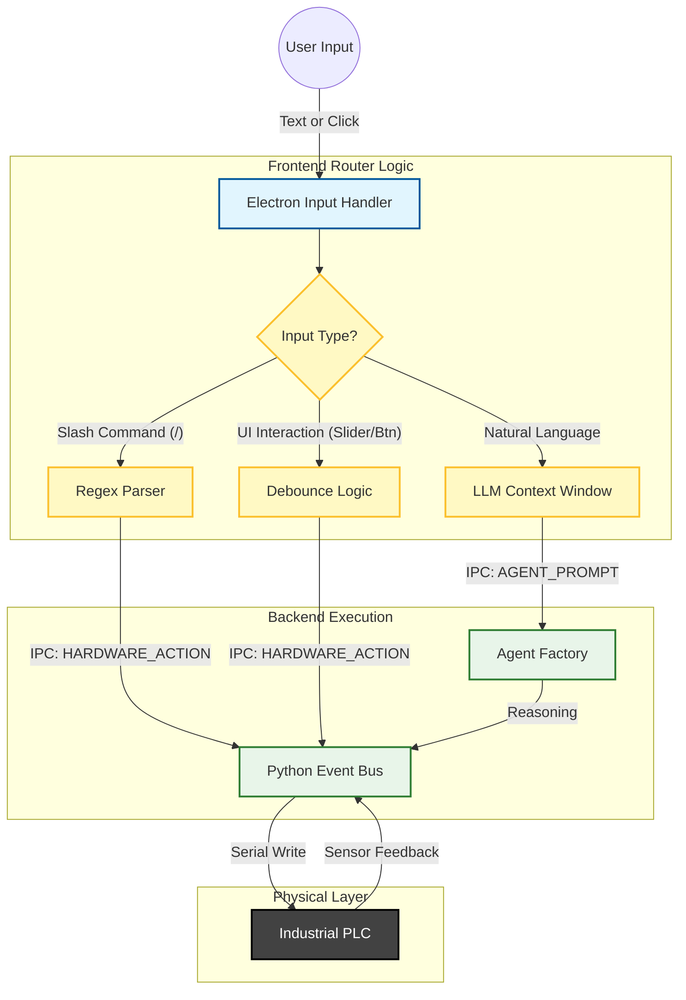
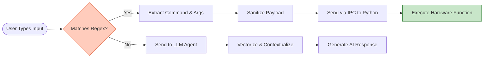
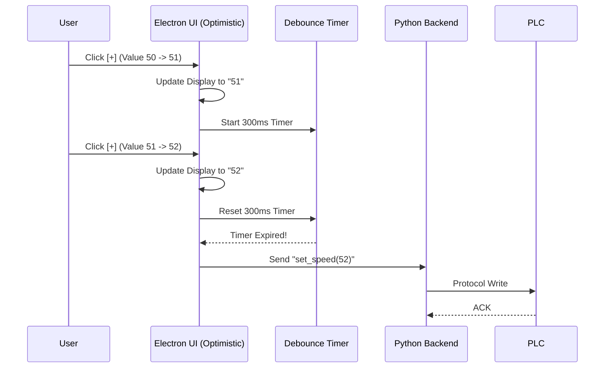

# 🔀 _SUDOTEER: THE HYBRID INPUT ROUTER
**Tier**: Platform Architecture
**Status**: Implemented / Live

## 1. Concept: The Input Funnel
The Electron frontend acts as a "Traffic Controller," splitting traffic between the local LLM and the direct Hardware connection to ensure safety and responsiveness.

## 2. Slash Command Parser (Deterministic Path)
**Goal:** Bypass the LLM for safety-critical or zero-latency commands (e.g., Emergency Stop, specific pump toggles).

### Logic Flow

### Pattern
`^\/(\w+)(?:\s+(.*))?$`

---

## 3. Virtual HMI (Debounced Control)
**Goal:** Enable "Analog" feel for digital controls without flooding the PLC serial buffer.

