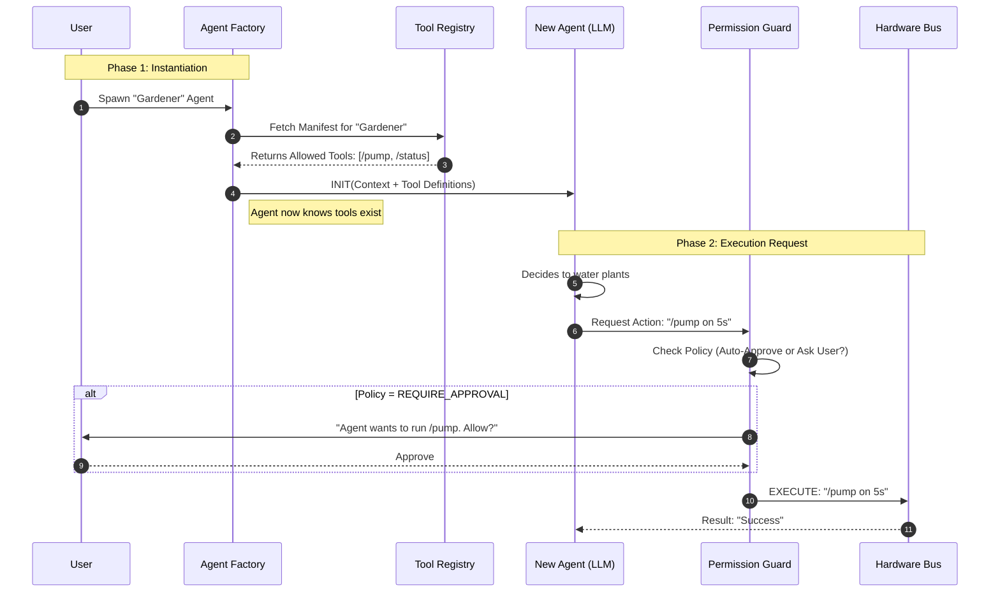
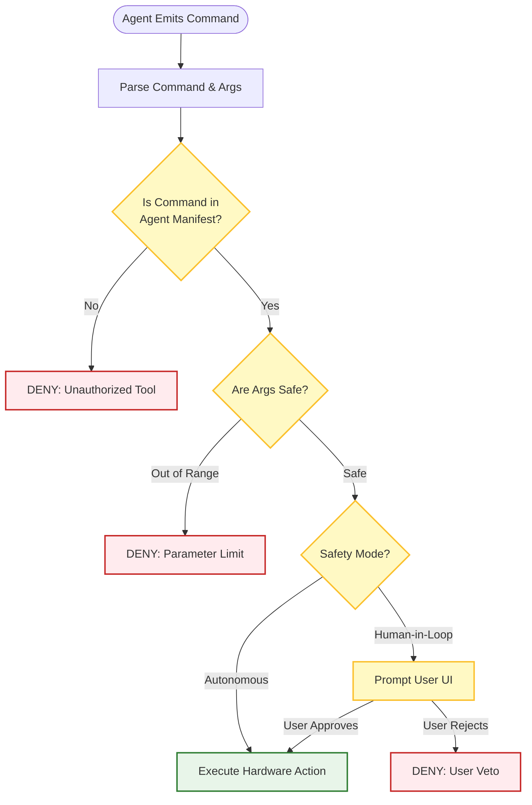

# 🏭 _SUDOTEER: AGENT FACTORY & PERMISSIONS
**Tier**: Platform Architecture
**Status**: Implemented (Core) / Scaling

## 1. Concept: The Tool Manifest
Before an agent is spawned, the Factory defines its "Reach." We treat hardware hooks as **Capabilities** granted via a Tool Registry.

## 2. Permission Guard Logic
The `PermissionGuard` intercepts every agent tool use, preventing hallucinations from touching wires they shouldn't.

