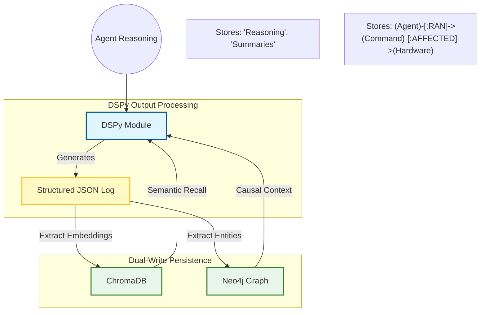

# 🧠 _SUDOTEER: HYBRID-COGNITIVE MEMORY
**Tier**: Platform Architecture
**Status**: Implemented / Live

## 1. The Dual-Write Architecture
_SUDOTEER_ implements a 3-layer hybrid memory system to ensure that agents are both Structurally Aware (Causality) and Semantically Grounded (Intelligence).

## 2. Memory Subsystems

### A. ChromaDB (Semantic Memory)
- **Purpose**: "What did I do last time the situation looked like this?"
- **Content**: Reasoning snippets, crisis debriefs, and horticultural wisdom.
- **Partitioning**: Each agent (Climate, Nutrient) has its own isolated collection to prevent "context pollution."

### B. Neo4j (Structural Audit)
- **Purpose**: "Who turned on the pump at 3 AM?"
- **Logic**: Models causal chains. (Agent) -> (Event) -> (Action) -> (Hardware Change).
- **Protocol**: Every `/command` write triggers a Graph Relation update.

### C. DSPy (The Cognitive Bridge)
- **Purpose**: Enforces typed outputs.
- **Role**: Ensures that chaotic agent thoughts are unified into structured JSON before being committed to memory.
