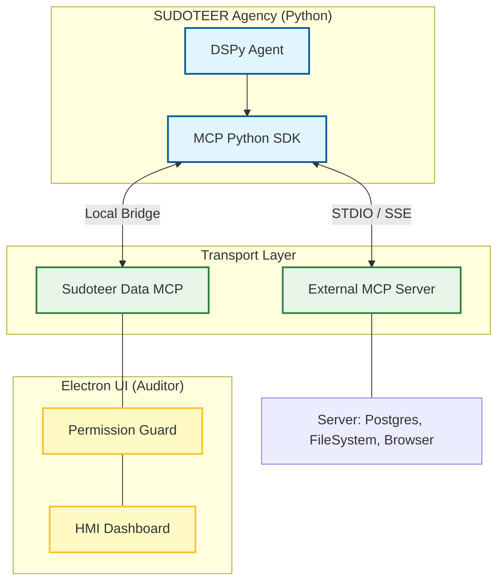

# 🌐 _SUDOTEER: MCP INTEGRATION ARCHITECTURE
**Tier**: Platform / Connectivity
**Status**: Proposed / Blueprint

## 1. Why MCP (Model Context Protocol)?
Integrating MCP into _SUDOTEER_ moves us from custom "Tool Registries" to a industry-standard protocol. This allows our agents to immediately tap into hundreds of existing data sources (Google Drive, Slack, Postgres, GitHub) without writing custom wrappers.

## 2. The Multi-Process Bridge
In an Electron/Python hybrid, the MCP architecture is split to ensure that agents have "Tool Supremacy" while the UI maintains the "Auditor" role.



## 3. Implementation Plan

### A. Python SDK Integration
We will use the `mcp` Python package. This allows our agents to dynamically "Discover" tools at runtime.

```python
# Proposed: backend/core/mcp_client.py
from mcp import ClientSession, StdioServerParameters
from mcp.client.stdio import stdio_client

async def use_mcp_tool(server_path: str, tool_name: str, args: dict):
    server_params = StdioServerParameters(command="node", args=[server_path])
    async with stdio_client(server_params) as (read, write):
        async with ClientSession(read, write) as session:
            await session.initialize()
            result = await session.call_tool(tool_name, args)
            return result
```

### B. Turning _SUDOTEER_ into an MCP Server
The most powerful move is to expose the `IndustrialBridge` as an MCP server. This allows **ANY** MCP-compatible AI (like Claude Desktop) to control the greenhouse.

```python
# Proposed: backend/core/mcp_server.py
from mcp.server.fastmcp import FastMCP

mcp = FastMCP("_SUDOTEER Hardware")

@mcp.tool()
async def set_pump_speed(percent: int) -> str:
    """Set the nutrient pump speed (0-100%)."""
    from backend.core.industrial_bridge import industrial_bridge
    success = await industrial_bridge.write_setpoint("pump", percent)
    return "Pump set successfully" if success else "Failed"
```

## 4. Benefits for the User
1.  **Interoperability**: You can use your _SUDOTEER_ greenhouse tools inside Claude Desktop or other AI IDEs.
2.  **Extensibility**: If you need to search your research papers, just plug in a "Paper Search" MCP server, and the Coder/Architect agents can read them immediately.
3.  **Standardized Safety**: MCP has built-in tool definitions, making it easier for our `PermissionGuard` to inspect what an agent is about to do.

---

**Next Action**: Would you like me to install the `mcp` SDK and create a prototype "Hardware MCP Server" for the greenhouse?
