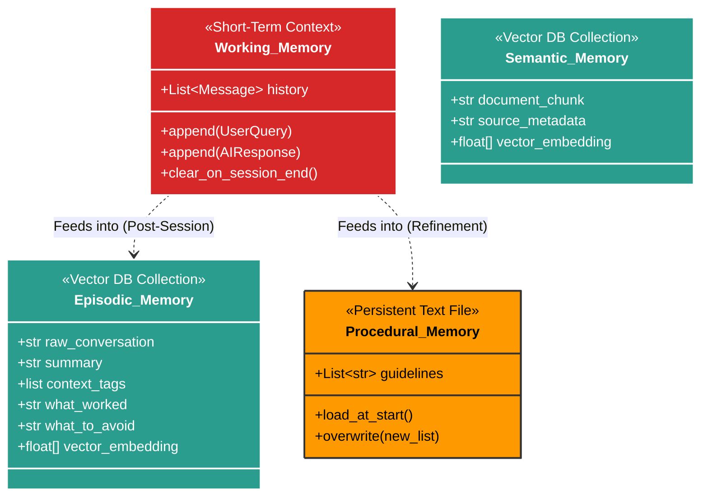

This "screenshot" visualizes the **Schema Definitions** for the four memory modules. It clearly distinguishes between the "Stateless" Working Memory and the three "Long-Term" storage types.

```mermaid
classDiagram
    %% Visual Style: Dark/Technical
    classDef memory fill:#232F3E,stroke:#fff,stroke-width:2px,color:#fff;
    classDef structure fill:#455A64,stroke:#333,stroke-width:1px,color:#fff;
    
    %% 1. Working Memory
    class Working_Memory {
        <<Short-Term Context>>
        +List~Message~ history
        +append(UserQuery)
        +append(AIResponse)
        +clear_on_session_end()
    }

    %% 2. Episodic Memory
    class Episodic_Memory {
        <<Vector DB Collection>>
        +str raw_conversation
        +str summary
        +list context_tags
        +str what_worked
        +str what_to_avoid
        +float[] vector_embedding
    }

    %% 3. Semantic Memory
    class Semantic_Memory {
        <<Vector DB Collection>>
        +str document_chunk
        +str source_metadata
        +float[] vector_embedding
    }

    %% 4. Procedural Memory
    class Procedural_Memory {
        <<Persistent Text File>>
        +List~str~ guidelines
        +load_at_start()
        +overwrite(new_list)
    }

    Working_Memory ..> Episodic_Memory : Feeds into (Post-Session)
    Working_Memory ..> Procedural_Memory : Feeds into (Refinement)
    
    style Working_Memory fill:#D62828,stroke:#fff,stroke-width:2px,color:#fff
    style Episodic_Memory fill:#2A9D8F,stroke:#fff,stroke-width:2px,color:#fff
    style Semantic_Memory fill:#2A9D8F,stroke:#fff,stroke-width:2px,color:#fff
    style Procedural_Memory fill:#FF9900,stroke:#333,stroke-width:2px,color:#000
```