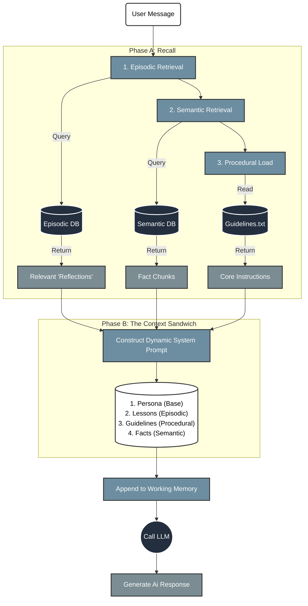

This flowchart represents the **Single Inference Step**. It visualizes how the agent constructs the prompt _before_ generating a response.

```mermaid
flowchart TD
    %% Visual Style: Logic Flow
    classDef input fill:#fff,stroke:#333,stroke-width:2px,color:#000;
    classDef process fill:#6D8EA0,stroke:#333,stroke-width:2px,color:#fff;
    classDef storage fill:#232F3E,stroke:#fff,stroke-width:2px,color:#fff;
    classDef output fill:#7B8D93,stroke:#333,stroke-width:2px,color:#fff;

    User(User Message):::input --> Step1[1. Episodic Retrieval]:::process
    
    subgraph Retrieval_Phase [Phase A: Recall]
        Step1 -->|Query| E_DB[(Episodic DB)]:::storage
        E_DB -->|Return| E_Data[Relevant 'Reflections']:::output
        
        Step1 --> Step2[2. Semantic Retrieval]:::process
        Step2 -->|Query| S_DB[(Semantic DB)]:::storage
        S_DB -->|Return| S_Data[Fact Chunks]:::output
        
        Step2 --> Step3[3. Procedural Load]:::process
        Step3 -->|Read| P_File[("Guidelines.txt")]:::storage
        P_File -->|Return| P_Data[Core Instructions]:::output
    end

    subgraph Assembly_Phase [Phase B: The Context Sandwich]
        E_Data & S_Data & P_Data --> Construct[Construct Dynamic System Prompt]:::process
        
        %% FIXED LINE BELOW: Added closing quote " before the closing )
        Construct --> ContextStruct[("1. Persona (Base) \n 2. Lessons (Episodic) \n 3. Guidelines (Procedural) \n 4. Facts (Semantic)")]:::input
    end
    
    ContextStruct --> WM[Append to Working Memory]:::process
    WM --> LLM((Call LLM)):::storage
    LLM --> Response["Generate Ai Response"]:::output
```