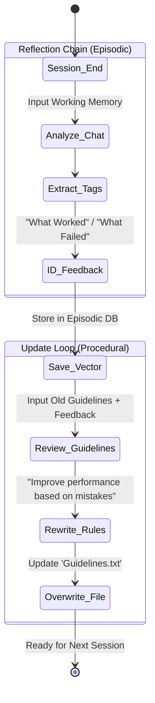

This diagram captures the **Reflection Chain** and **Procedural Update Loop** that happens _after_ the conversation ends. This is the "Learning" mechanism.

```mermaid
stateDiagram-v2
    %% Visual Style: State Machine
    classDef state fill:#232F3E,color:#fff,stroke:#fff;
    
    [*] --> Session_End
    
    state "Reflection Chain (Episodic)" as Reflection {
        Session_End --> Analyze_Chat: Input Working Memory
        Analyze_Chat --> Extract_Tags
        Extract_Tags --> ID_Feedback: "What Worked" / "What Failed"
        ID_Feedback --> Save_Vector: Store in Episodic DB
    }

    state "Update Loop (Procedural)" as Update {
        Save_Vector --> Review_Guidelines: Input Old Guidelines + Feedback
        Review_Guidelines --> Rewrite_Rules: "Improve performance based on mistakes"
        Rewrite_Rules --> Overwrite_File: Update 'Guidelines.txt'
    }
    
    Overwrite_File --> [*]: Ready for Next Session
```