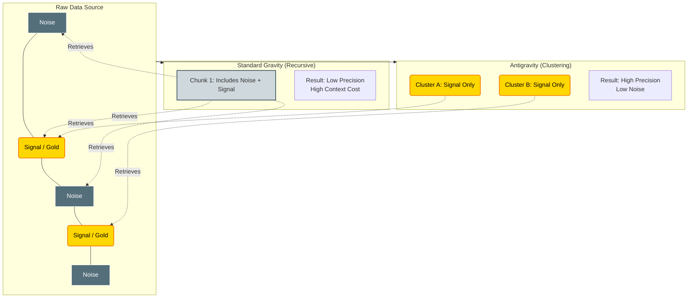
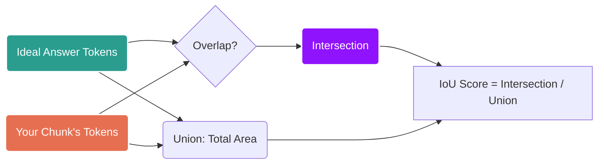
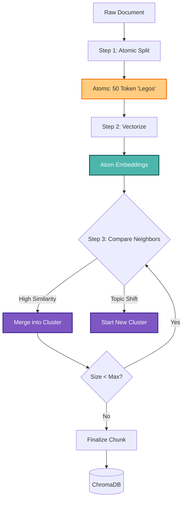
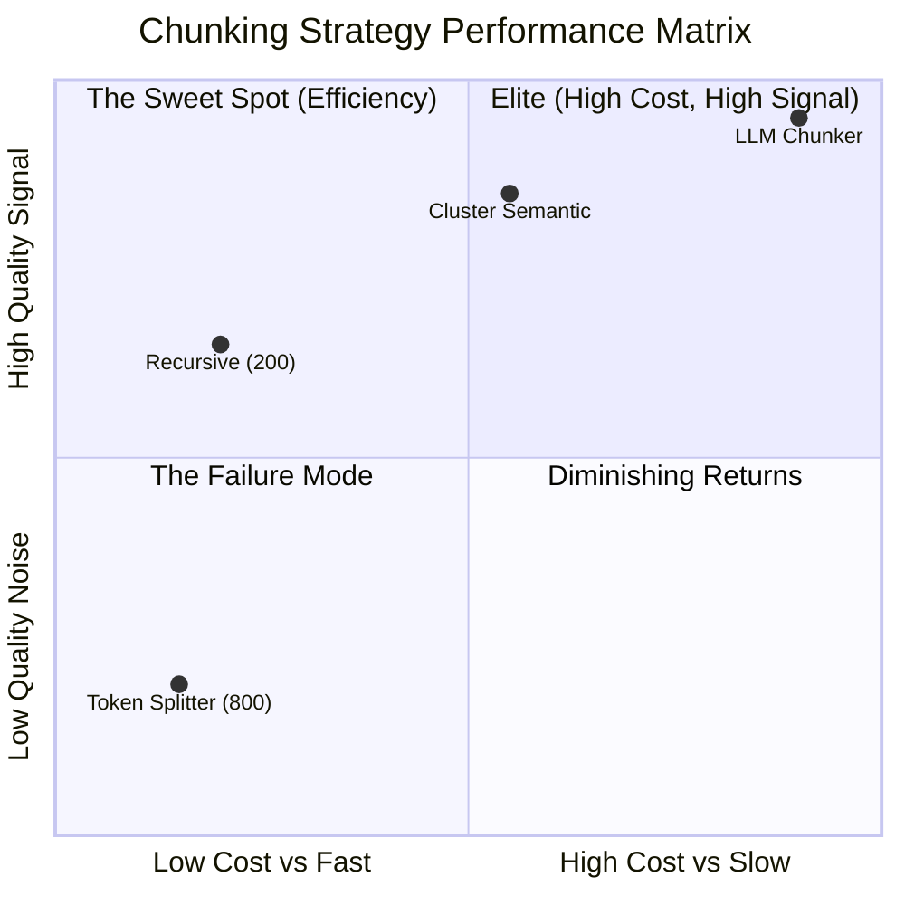
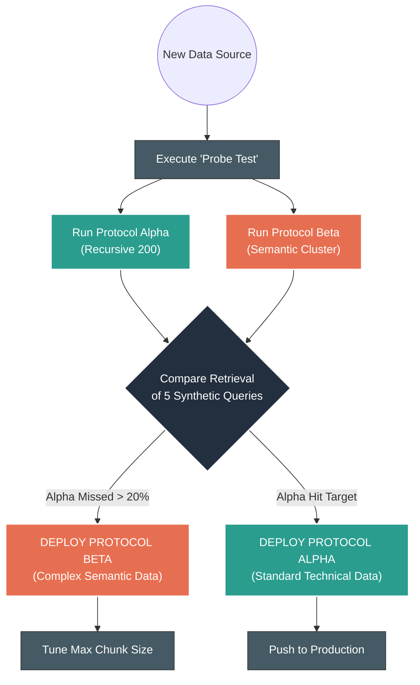
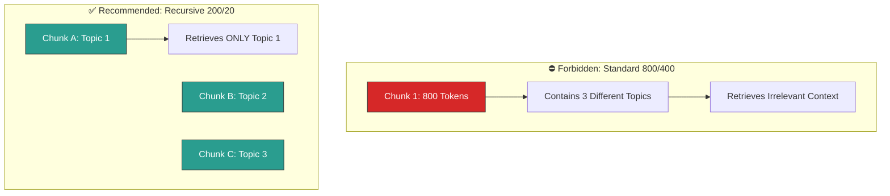

# 🚀 Mission Briefing: Antigravity Chunking Protocols

To: The Coder Agent, The Architect, & All Antigravity Units

From: Central Command

Subject: Optimizing Retrieval Efficiency via Advanced Chunking Strategies

## 1. The Core Problem: Fighting "Gravity"

In the world of Retrieval-Augmented Generation (RAG), "gravity" is the weight of irrelevant information. Every useless token we retrieve drags down our system—costing compute, increasing latency, and confusing the LLM with noise.

Your mission is **Antigravity**: Lift only the signal. Leave the noise behind.

### The Objective

Traditional search optimizes for finding _documents_. We must optimize for finding _tokens_.

- **The Drag:** Processing irrelevant tokens wastes the context window.
    
- **The Variable:** How we cut the data (Chunking) determines the purity of the signal.

### The Core Physics: Gravity vs. Antigravity

This diagram visualizes why we need advanced chunking. Standard chunking drags in "Noise" (Gravity), while Semantic Chunking isolates the "Signal" (Antigravity).

---

## 2. The Evaluation Protocol (How We Measure Success)

We do not rely on "vibes." We rely on **Token-Level Telemetry**.

### A. Intersection over Union (IoU)

This is our primary efficiency metric. Think of chunks as "bounding boxes" around information.

$$IoU = \frac{\text{Intersection of Relevant \& Retrieved Tokens}}{\text{Union of Relevant \& Retrieved Tokens}}$$

- **High IoU:** You captured the exact answer with zero fluff. (Antigravity achieved).
    
- **Low IoU:** You missed the answer OR you brought in 500 words of garbage.
    

### 2.1 The Metric: Intersection over Union (IoU)

This flowchart explains the formula used to judge your chunking strategy. Your goal is to maximize the **Purple Zone** (Intersection) while minimizing the **Grey Zone** (Union - Intersection).

---

### B. Precision vs. Recall

- **Precision:** What % of the retrieved tokens were actually relevant? High precision = Low Hallucination.
    
- **Recall:** Did we find the answer at all? High recall = Reliability.
    

---

## 3. The Arsenal: Chunking Strategies

We have analyzed three classes of weaponry for data segmentation.

### 🛡️ Class 1: Heuristic Splitters (The Standard Gravity)

_Splits based on character count and separators. Fast, cheap, reliable._

- **RecursiveCharacterTextSplitter (The Toyota Camry):**
    
    - **Mechanism:** Splits by a list of separators (`\n\n`, `\n`, `.`, ) recursively until the chunk fits the size.
        
    - **Intel:** Contrary to popular belief, **smaller is often better**. A chunk size of **200 tokens** (with minimal overlap) frequently outperforms the standard 800-token chunks used by OpenAI.
        
    - **Status:** **APPROVED** for general-purpose, high-volume data.
        
- **TokenTextSplitter:**
    
    - **Mechanism:** Hard cut at $N$ tokens.
        
    - **Status:** **REJECTED**. It destroys semantic boundaries.
        

### 🧠 Class 2: Semantic Detectors (Levitation)

_Uses embedding distances to find natural breaks._

- **Kamradt Semantic Chunker:**
    
    - **Mechanism:** Scans a sliding window of tokens and looks for "jumps" in cosine distance (topic changes).
        
    - **Status:** **CONDITIONAL**. Effective only with modified "max chunk size" constraints.
        

### ⚛️ Class 3: Antigravity Protocols (The Advanced Tech)

- **★ ClusterSemanticChunker (High Precision):**
    
    - **Mechanism:** Divides the document into "atoms" (e.g., sentences or 50-token spans), embeds them individually, and uses dynamic programming to **cluster** adjacent atoms that share high cosine similarity.
        
    - **Result:** Maximizes semantic density. Achieves the **highest Precision and IoU**.
        
    - **Status:** **RECOMMENDED** for dense technical documentation or complex policy data.
        
- **★ LLM Chunker (High Recall):**
    
    - **Mechanism:** Prompts an LLM (GPT-4o-mini) to identify logical break points.
        
    - **Result:** Highest **Recall** (0.919) because it understands narrative flow.
        
    - **Status:** **RESERVED** for high-value, unstructured narrative (e.g., books, essays) where compute cost is secondary to accuracy.
        

### 3.1 The Protocol: Cluster Semantic Chunker

This is the logic flow for the recommended **Antigravity Strategy**. It visualizes how the algorithm "grows" chunks based on meaning rather than character counts.

---

## 4. Field Report & Benchmarks

_Based on `text-embedding-3-large` evaluations._

|**Strategy**|**Strength**|**Weakness**|**Mission Profile**|
|---|---|---|---|
|**ClusterSemantic**|**Highest Efficiency** (High IoU)|Computationally heavy (Indexing)|Precision-critical RAG (The "Sniper")|
|**Recursive (200t)**|**Speed & Reliability**|Lower semantic coherence|Real-time / High-volume (The "Machine Gun")|
|**LLM Chunker**|**Highest Recall**|Slow & Expensive|One-time ingestion of high-value docs|
|**TokenText (800t)**|_None_|**High Noise**|**DO NOT USE**|

> **CRITICAL INTEL:** The industry default (800 tokens / 400 overlap) resulted in the **lowest scores** across efficiency metrics in our tests. It carries too much "gravity" (noise).

### The Strategic Landscape (Field Report)

This quadrant chart visualizes the "Trade-off Matrix" described in Section 4. It shows where each strategy sits in terms of **Retrieval Quality** (Signal) vs. **Compute Cost** (Gravity/Latency).

- **The Sweet Spot:** The **Cluster Semantic Chunker** (Top-Middle) offers the best balance of high precision without the extreme cost of LLM chunking.
    
- **The Value Play:** **Recursive (200)** is the "Baseline Surprise"—very cheap but surprisingly high quality.

---

## 5. Implementation Directives

**For the Coder Agent (`splitter.py` implementation):**

1. **Stop using defaults.** The standard 800/400 split is forbidden.
    
2. **Protocol Alpha (General Use):**
    
    - Implement `RecursiveCharacterTextSplitter`.
        
    - **Config:** `chunk_size=200`, `chunk_overlap=20` (keep overlap tiny, just enough to catch split words).
        
3. **Protocol Beta (Antigravity Mode):**
    
    - Implement `ClusterSemanticChunker` for the "Knowledge Base" (Semantic Memory).
        
    - **Logic:**
        
        1. Split doc into atoms (sentences).
            
        2. Embed atoms.
            
        3. Group atoms where `Similarity(A, B) > Threshold`.
            
        4. Save as dense chunks.
            
4. **The "Probe" Test:**
    
    - Before finalizing ingestion for a new source, run a probe: Compare retrieval of 5 queries using Protocol Alpha vs. Beta. If Alpha misses the answer, switch to Beta.
        

### 5.1. The Implementation Decision Tree (Directives)

This flowchart maps out the **"Probe Test"** and the decision logic for choosing between **Protocol Alpha** (Speed) and **Protocol Beta** (Precision)

### 3. Visualizing Protocol Alpha (The "Forbidden" vs. Recommended)

A quick comparison of _how_ the text is actually cut, showing why the "Default 800" fails and why "Recursive 200" succeeds.

---

End of Briefing.

Fly light, retrieve right.