**Goal:** Understand how internal memory systems support decision-making loops in LLMs.

## Phase 1: The Anatomy (Section A)

**Objective:** Map the components of the agent's internal "brain."

In this phase, we establish the static structure. The agent is not just an LLM; it is a system of memory modules centered around a **Working Memory** hub.

### 1.1 The Environment Interface

The agent interacts with the world through three specific modalities.

- **Dialogue:** Conversational interactions (Human-to-Agent).
    
- **Physical:** Embodied actions (e.g., robotic movement).
    
- **Digital:** Tool usage (e.g., CLI, API calls, coding).
    

### 1.2 The Memory Hierarchy

Data flows from the environment into **Working Memory**, which acts as the "Central Processor." It offloads storage to three Long-Term systems:

- **Procedural Memory (Implicit):** "Knowing How." Stores the LLM weights and hard-coded agent logic.
    
- **Semantic Memory (Explicit):** "Knowing Facts." A database of world knowledge.
    
- **Episodic Memory (Explicit):** "Knowing the Past." A log of past experiences and outcomes.
    

### 1.3 Architecture Diagram

This diagram reconstructs the logic of "Section A," showing the data flow between the central processor and its storage units.

```mermaid
graph TD
    %% Visual Style: Cognitive Map
    classDef memory fill:#CFD8DC,stroke:#455A64,stroke-width:2px,color:#263238;
    classDef working fill:#E1F5FE,stroke:#0277BD,stroke-width:2px,color:#01579B;
    classDef interface fill:#FFF3E0,stroke:#EF6C00,stroke-width:2px,color:#E65100;
    classDef process fill:#F5F5F5,stroke:#9E9E9E,stroke-width:1px,stroke-dasharray: 3 3;

    subgraph Long_Term_Memory [Long-Term Memory Modules]
        direction TB
        %% The fix: Wrapped label in quotes and changed inner quotes to single quotes
        Procedural["Procedural Memory\n('LLM & Code')"]:::memory
        Semantic["Semantic Memory\n(Facts DB)"]:::memory
        Episodic["Episodic Memory\n(Past Experience)"]:::memory
    end

    subgraph Active_Processing [Central Processing]
        WM["Working Memory\n(Reasoning Core)"]:::working
        Decision["Decision Procedure\n(Tree Logic)"]:::working
        
        WM <--> Decision
    end

    subgraph Interfaces [Environment Interfaces]
        direction TB
        Dialogue([🗣️ Dialogue]):::interface
        Physical([🌍 Physical]):::interface
        Digital([💻 Digital]):::interface
    end

    %% Flows
    Interfaces -->|Observations| WM
    WM -->|Actions| Interfaces
    
    %% Memory Retrieval & Learning Loops
    WM -->|Learning| Procedural
    Procedural -->|Retrieval| WM
    
    WM -->|Learning| Semantic
    Semantic -->|Retrieval| WM
    
    WM -->|Learning| Episodic
    Episodic -->|Retrieval| WM
```

---

## 🔄 Phase 2: The Thinking Process (Section B)

**Objective:** Trace the lifecycle of a single thought.

Once the architecture is in place, the agent enters a continuous loop of **Observation**, **Planning**, and **Execution**. This is where "Thinking" happens.

### 2.1 The Planning Loop

Before acting, the agent iterates through internal simulation:

1. **Proposal:** The agent generates potential next steps (using Procedural Memory/LLM).
    
2. **Evaluation:** The agent predicts the outcome or value of those steps (Reasoning).
    
3. **Selection:** The best option is chosen for execution.
    

### 2.2 The Execution Cycle Diagram

This flowchart reconstructs "Section B," illustrating the feedback loop.

---

## 🧩 Synthesis: How A & B Connect

To fully understand the system, we must overlay the **Process (B)** onto the **Architecture (A)**:

1. **Observation:** Data enters through the **Interface** and lands in **Working Memory**.
    
2. **Proposal (Planning):** Working Memory queries **Procedural Memory** (the LLM) to draft a plan.
    
3. **Evaluation (Planning):** Working Memory checks **Semantic Memory** (Facts) and **Episodic Memory** (Past Mistakes) to validate the plan.
    
4. **Selection & Execution:** The final decision is passed back to the **Interface** as an Action, and the result is saved to **Episodic Memory** (Learning).