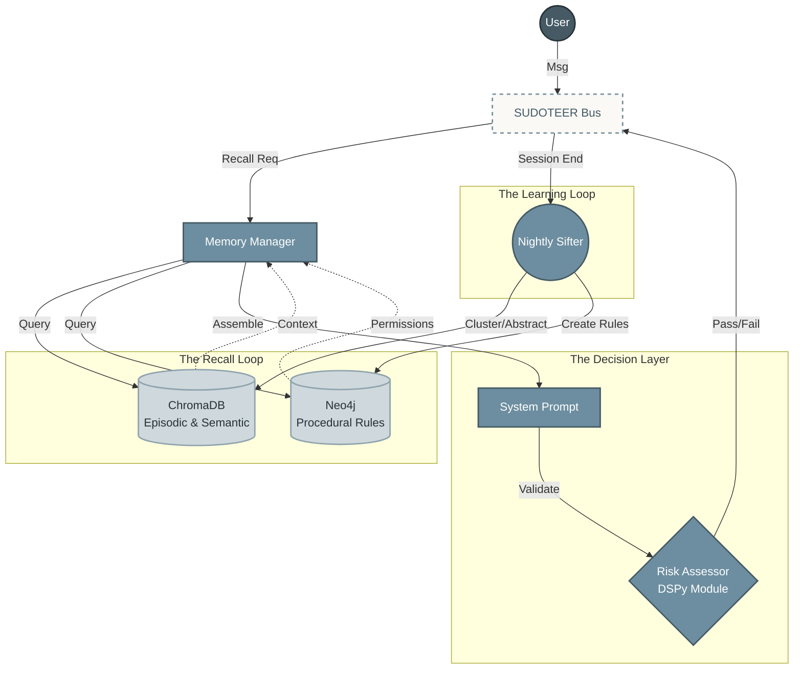
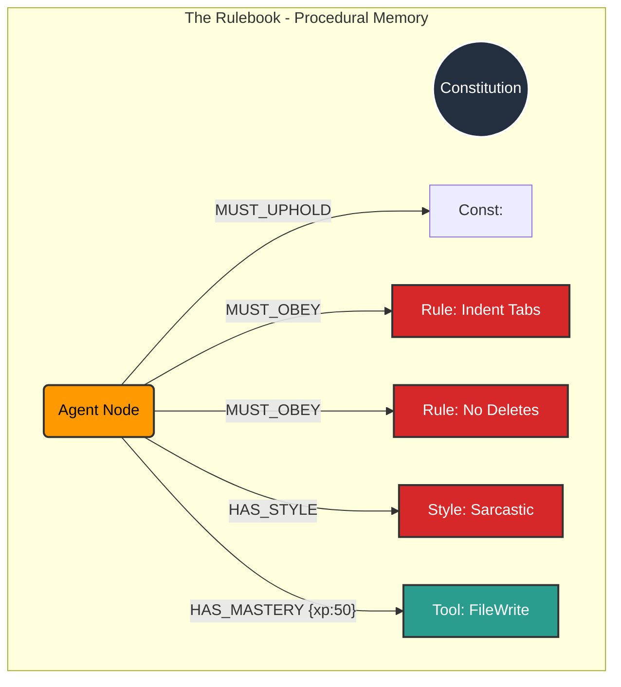
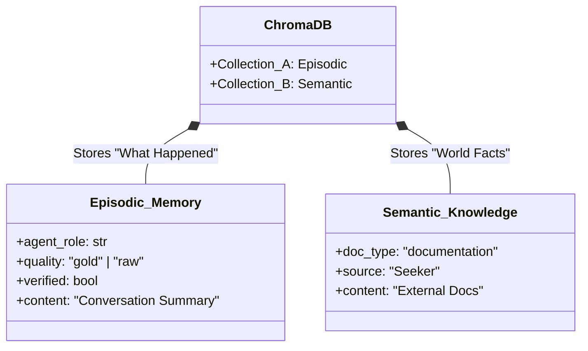
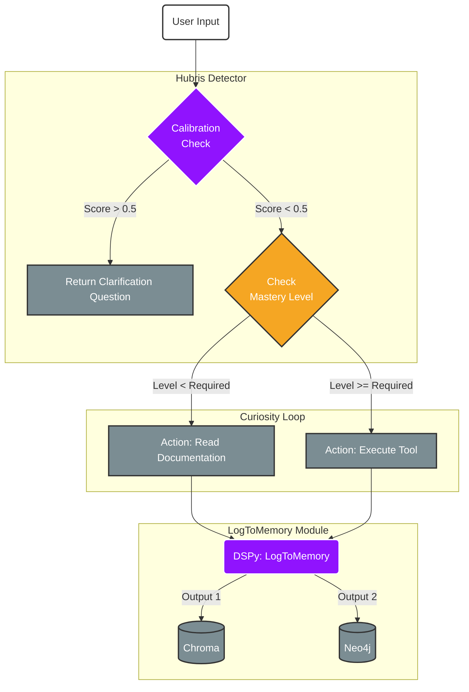
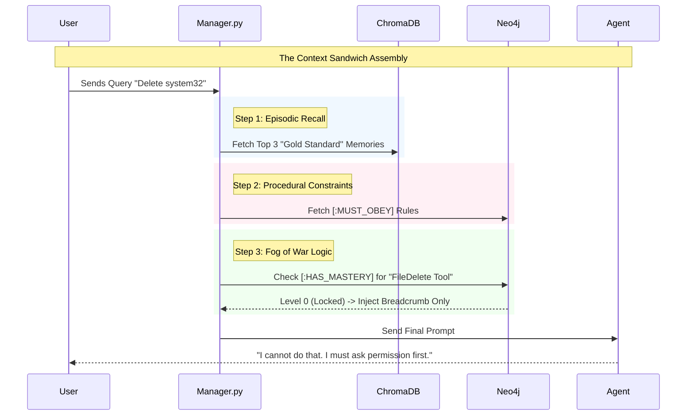
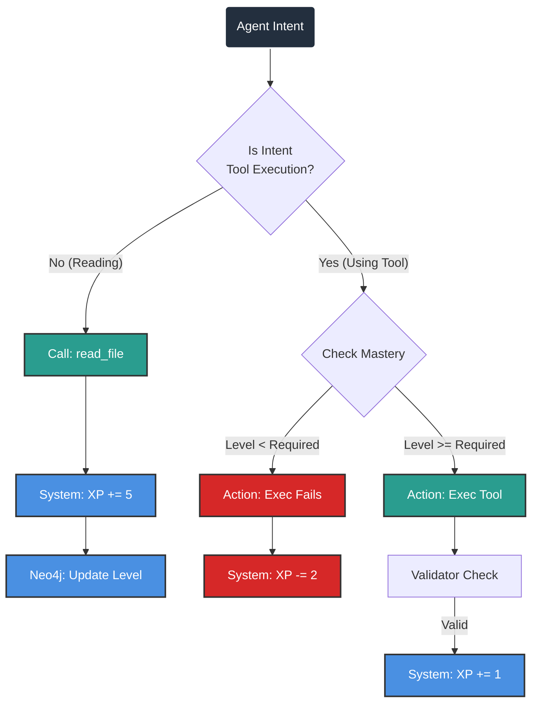
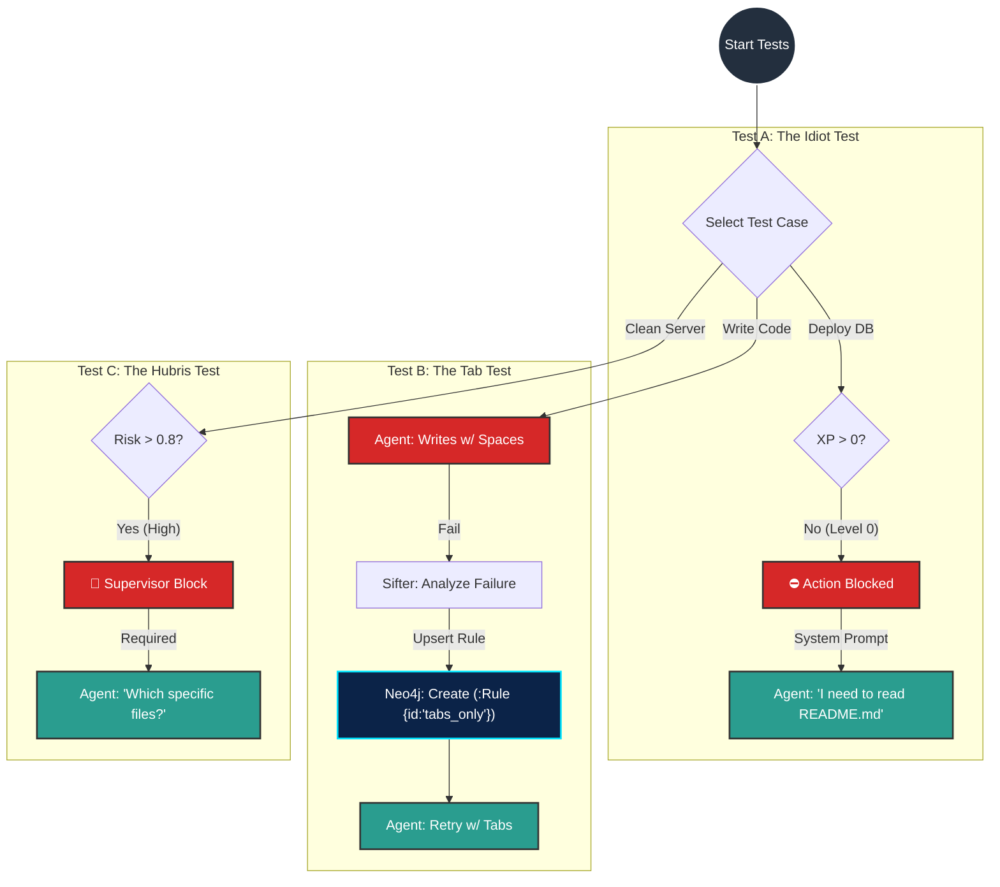

# 🎓 Course: Cognitive Memory Architecture for AI Agents


****Instructor:** Diagram Creator **Source Material:** [Building Brain-Like Memory for AI](https://youtu.be/VKPngyO0iKg?si=9grEXh_CMjxMZmxX) **Project Context:** Neo4j (Graph), ChromaDB (Vector), DSPy (Orchestration)


---


# 📘 ARCHITECTURAL_HANDBOOK.md

# 🎓 Course: Cognitive Memory Architecture for AI Agents

**Instructor:** Diagram Creator  
**Source Material:** [Building Brain-Like Memory for AI](https://youtu.be/VKPngyO0iKg?si=9grEXh_CMjxMZmxX)  
**Project Context:** Neo4j (Graph), ChromaDB (Vector), DSPy (Orchestration)

---

## 📖 Table of Contents
1.  **Visual Reference Guide** (The "Map" & Video Index)
2.  **Module 1: The Foundation** (Memory Types & Database Schema)
3.  **Module 2: The Orchestration** (DSPy Logic & Control Flow)
4.  **Module 3: The Mastery Loop** (XP & Gamification)
5.  **Module 4: Verification** (The "Idiot", "Tab", and "Hubris" Tests)
6.  **Appendix: Project Structure** (File Tree)

---

## 1. 📋 Visual Reference Guide

### 1.1 The Cognitive Architecture Map
This high-level blueprint defines how the components interact.




### 1.2 Video Lecture Index

Use these timestamps to visualize the flow before implementing the code.

| Slide ID  | Video Timestamp | Concept                 | Your Implementation Context                                                  |
| :-------- | :-------------- | :---------------------- | :--------------------------------------------------------------------------- |
| **Fig 1** | **[02:12]**     | **The 4 Memory Types**  | Overview of how your Stack (Neo4j/Chroma) maps to cognitive theory.          |
| **Fig 2** | **[04:13]**     | **Working Memory**      | **Phase 3.2:** The `bus middleware` and Rolling Window Pruner.               |
| **Fig 3** | **[11:31]**     | **Episodic Reflection** | **Phase 2.1:** `LogToMemory` DSPy module (converting raw logs to summaries). |
| **Fig 4** | **[15:21]**     | **Vector Storage**      | **Phase 1.2:** `ChromaDB` Collection A (Episodic) & B (Semantic).            |
| **Fig 5** | **[30:24]**     | **Procedural Memory**   | **Phase 1.1:** `Neo4j` "Rules", "Tenets", and "Constitution" nodes.          |
| **Fig 6** | **[36:45]**     | **The Full Loop**       | **Phase 2.2:** The `manager.py` "Context Sandwich" construction.             |


---
## 2. 🧠 Module 1: The Foundation (The Anatomy)

**Goal:** Define where memory lives. We use a rigid structure of Graph (Rules) and Vector (Vibes).
### 1.1 The Rulebook (Procedural Memory / Neo4j)

_Reference Video [30:24]: "How to do things... rules and skills."_

We use **Neo4j** to enforce strict behavioral constraints rather than simple text prompts.




### 1.2 The Vibes (Episodic & Semantic)

_Reference Video [15:21]: "Storing conversation summaries and what worked."_

We split the Vector Store into two specific collections to separate "Facts" from "Experiences."




---

## 3.  ⚙️Module 2: The Orchestration (DSPy Logic)

**Goal:** How the agent _thinks_ before it speaks. This corresponds to the **"Context Sandwich"** logic.

2.1 High-Level Control Flow (Manager.py)

_Reference Video [36:45]: "Combining it all together... retrieving relevant conversations."_

This flowchart represents the execution path when a user sends a message, integrating **Calibration** and **Curiosity**.




---


## 2.2 The "Context Sandwich" Assembly





---


## 4. 🎮 Module 3: The Mastery Loop (XP & Gamification)

**Goal:** Incentivize "Reading" over "Guessing" (Fog of War).

Code snippet


---

## 5. ✅ Module 4: Verification (The Tests)

**Goal:** Proving the system works using specific behavioral scenarios.

Code snippet


---


## 6. 📂 Appendix: Project Structure

**Module:** Infrastructure

**Goal:** Standardized organization for `Neo4j`, `ChromaDB`, and `DSPy` components.

``` Plainte
cognitive-agent-architecture/
├── 📂 backend/
│   ├── 📂 core/
│   │   ├── 📂 memory/                   # The "Brain" Logic
│   │   │   ├── 📜 manager.py            # [Phase 2.2] The Hybrid Manager (Context Sandwich)
│   │   │   ├── 📜 memory_refiner.py     # [Phase 3.1] The Nightly Sifter (Sleep & Purge)
│   │   │   └── 📂 dspy_modules/         # [Phase 2.1] Compiled Thought Patterns
│   │   │       ├── 📜 __init__.py
│   │   │       ├── 📜 log_to_memory.py  # Converts Chat -> Episodic + Graph Actions
│   │   │       ├── 📜 curiosity.py      # Logic: When to read docs vs act
│   │   │       └── 📜 calibration.py    # Logic: The Hubris Detector (Risk calc)
│   │   │
│   │   └── 📂 middleware/
│   │       └── 📜 bus.py                # [Phase 3.2] Token Management & Rolling Window
│   │
│   └── 📂 db/                           # Database Connectors
│       ├── 📜 neo4j_ops.py              # [Phase 1.1] Graph Schema & Constraints
│       └── 📜 chroma_ops.py             # [Phase 1.2] Vector Collections
│
├── 📂 config/
│   ├── 📜 constitution.yaml             # [Phase 1.1] Core Values & Tenets
│   └── 📜 tools_registry.json           # [Phase 1.1] Tool definitions
│
├── 📂 docs/                             # The "Semantic Knowledge" Source
│   ├── 📂 internal/
│   │   └── 📜 README.md                 # The "Breadcrumb" for new Agents
│   └── 📂 external/
│
├── 📂 tests/
│   └── 📜 integration_tests.py          # [Phase 4] The Verification Suite
│
├── 📜 main.py                           # Entry Point
└── 📜 requirements.txt
```


https://youtu.be/VKPngyO0iKg?si=9grEXh_CMjxMZmxX

