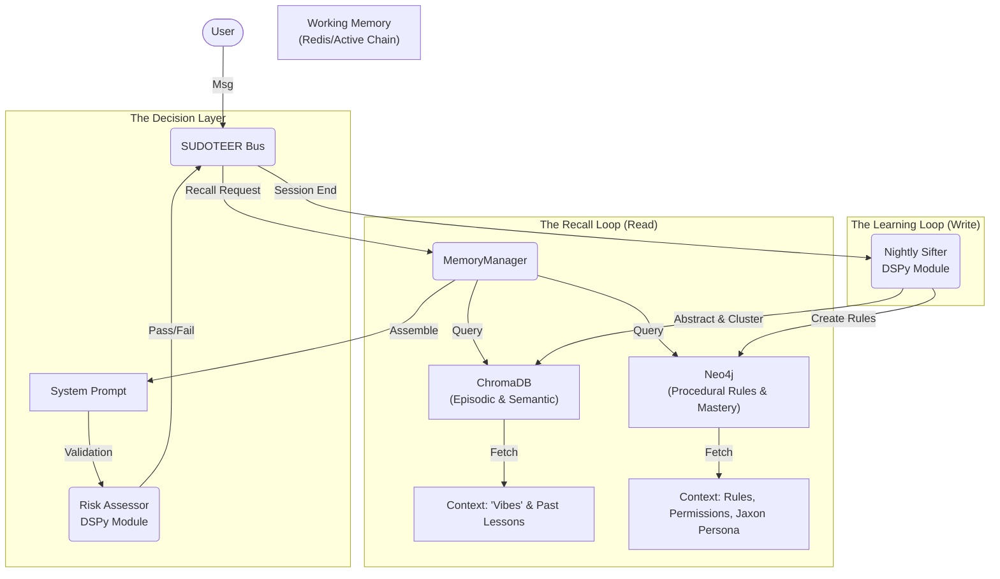

**Version:** 1.0 (The "Antigravity" Edition) **Target Agent:** Coder / Architect **Priority:** P0 - Critical Infrastructure

## 📂 Part 1: Architecture Visuals (The Map)

_Context: This diagram outlines the data flow between the User, the Orchestrator, and the 4 Memory Storage Engines._



---


## 📝 Part 2: The Core Concept (Source Summary)

**Source:** "Building Brain-Like Memory for AI" (Adam Lucek) **Adapted for:** SUDOTEER (Neo4j + ChromaDB Implementation)

We are moving beyond stateless "Chat" to stateful "Agency" by implementing 4 distinct memory types:

1. **Working Memory:** The active context window (Short-term). _Implemented via: Redis/Context List._
    
2. **Episodic Memory:** Past experiences ("What happened?"). _Implemented via: ChromaDB (Vector)._
    
3. **Semantic Memory:** Facts and Knowledge ("What do I know?"). _Implemented via: ChromaDB (Vector)._
    
4. **Procedural Memory:** Skills, Rules, and Habits ("How do I do it?"). _Implemented via: Neo4j (Graph)._
    

**Key Innovation:** We are adding a **"Sifter"** (Garbage Collector) that compresses repetitive logs into high-level "Wisdom," and a **"Fog of War"** mechanic to enforce Progressive Mastery (preventing hubris).

---


## 🛠️ Part 3: Technical Specifications

### A. The Data Layer (Schema)

**1. Neo4j (The Rulebook):**

- **Nodes:** `Agent`, `Tool`, `Rule`, `Constitution`, `Persona`, `DocChunk`.
    
- **Relationships:**
    
    - `(:Agent)-[:HAS_MASTERY {xp: int}]->(:Tool)`
        
    - `(:Agent)-[:MUST_OBEY]->(:Rule)`
        
    - `(:Agent)-[:MUST_UPHOLD]->(:Constitution)`
        
    - `(:DocChunk)-[:UNLOCKS]->(:DocChunk)`
        

**2. ChromaDB (The Library):**

- **Collection `episodes`:** `{ content, summary, tags, quality_score }`
    
- **Collection `knowledge`:** `{ content, source, embedding }`
    

### B. The Logic Layer (DSPy Modules)

**1. `LogToMemory`:**

- Parses raw chat -> Extracts "Graph Actions" (Cypher) and "Vector Summaries" (Text). **2. `PrincipleExtractor` (The Sifter):**
    
- Takes a cluster of similar logs -> Outputs one abstract "Meta-Lesson". **3. `CuriosityLoop`:**
    
- Detects low Mastery -> Triggers `read_docs()` instead of `exec_tool()`. **4. `CalibrationCheck`:**
    
- Detects Ambiguity > 0.5 -> Forces a "Clarification Question."


---


## ✅ Part 4: Implementation Checklist (The "Manifest")

### Phase 1: Foundation

- [ ] **Schema Setup:** Define Neo4j constraints and Chroma collections.
    
- [ ] **Bootstrap Knowledge:** Load the "Constitution" node (Safety Tenets) and "Jaxon" Persona (Style).
    
- [ ] **Tool Ingestion:** Load Tool docs into Graph as tiered `DocChunk` nodes (Breadcrumb -> Basic -> Advanced).
    

### Phase 2: Logic & Orchestration

- [ ] **DSPy Compile:** Create and compile `LogToMemory` and `CuriosityLoop` with few-shot examples.
    
- [ ] **Manager Logic:** Implement `recall()` to merge Graph Rules + Vector Context.
    
- [ ] **Fog of War:** Implement logic to withhold docs if `Mastery Level` is low.
    

### Phase 3: Safety & Maintenance

- [ ] **Risk Gavel:** Implement `Supervisor` check for high-risk actions.
    
- [ ] **The Sifter:** Create the cron script to cluster and deduplicate memory nightly.
    
- [ ] **Token Pruner:** Implement the rolling window summarizer for long chats.


---

📎 Appendix: Raw Transcript (Reference)

```
# Building Brain-Like Memory for AI | LLM Agent Memory Systems

**Speaker: Adam Lucek**
**Source:** https://youtu.be/VKPngyO0iKg

[00:00:00] hello everybody Adam LK here and today we're going to be talking about applying different memory Frameworks towards agentic setups
[00:00:07] the idea of memory has really become a core concept when building agentic language model based systems and the reason
[00:00:14] behind that is because when you consider a language model and actually interacting with a language model every time that
[00:00:20] you run inference or call the language model it's considered to be almost stateless and what we mean by this
[00:00:27] is that language models don't have any prior recollection any prior knowledge or any prior contextualization past what you have
[00:00:35] actually given to the model itself to do its generation step so in the process of creating agents and agentic
[00:00:43] flows essentially what we're trying to do at the core of it is simulate the way that humans actually approach
[00:00:49] different problem solving techniques and the limitation of not being able to contextualize what's going on in the current environment
[00:00:57] really is detrimental towards the language models of ability to fully execute on a given task in comparison when you
[00:01:03] and I actually approach a task we bring all of our general knowledge that we have about the world that
[00:01:09] we've gained through all of our lived experiences we have also the understanding of Prior similar tasks that we may
[00:01:15] have done in the past we have the takeaways and Reflections that we've gone through after executing prior tasks as
[00:01:23] well as what we've actually specifically learned how to do or have been taught this allows us to instantly contextualize
[00:01:30] and shape our approach to Any Given task while we're working through it and really at the heart of it
[00:01:35] what all of this is coming down to is that we as humans have advanced memory and the ability to
[00:01:41] learn from and apply those learnings towards new experiences whereas things like language models do not so to compensate for
[00:01:49] this what we can do is actually take some psychology Concepts and model different forms of memory recall and continuous
[00:01:58] learning within agentic system design more specifically what we're going to do is we're going to create through the course
[00:02:04] of this video and this notebook a retrieval augmented generation based agent that models four different kinds of memory your
[00:02:12] working memory which covers the current conversation and media context within it your episodic memory which in the case of
[00:02:19] a chatbot would be historical experiences and their different takeaways we'll have semantic memory or the knowledge context and factual
[00:02:28] grounding and then finally procedural memory which outlines the rules and skills for interaction all of this is essentially going
[00:02:36] to be an approach to and an exploration in modeling architecting and understanding cognitive design when applied back to agentic
[00:02:46] Applications so we're going to break down each type of memory and an example of how to implement them as
[00:02:53] well as how it relates back to how our own memory works but right before we get into that much
[00:02:59] of this was actually inspired by this paper here cognitive architectures for language agents so if you're interested in some
[00:03:04] of the different Frameworks that these different cognitive architectures offer I'll definitely be linking this paper in the description below
[00:03:12] go ahead and give it a quick scan so the first type of memory that we're going to be modeling
[00:03:16] and the simplest form to actually model is going to be what's called working memory working memory is essentially going
[00:03:23] to Encompass all of our active direct understanding and contextualization of immediate information that we are processing for a chatbot
[00:03:34] this represents the maintenance and manipulation of conversational context observed through the real-time interactions that are going on for humans
[00:03:43] this is essentially going to be our short-term memory or kind of the immediate things that we are experiencing as
[00:03:51] they're being experienced and how we're able to contextualize everything that's been going on in the immediate or the short
[00:03:59] term to better approach something this is the most common form of memory actually within agents or chatbot based experiences
[00:04:06] that leverage language models because essentially what it's going to be is keeping track of all of the different messages
[00:04:13] that have gone back and forth between both the user and the AI assistant and as each message is generated
[00:04:20] it's going to be added to this list of message and then reprocess through to generate some additional message working
[00:04:26] memory then is going to really function as the active computational interface here coordinating all of the information flows between
[00:04:34] all of our other memory systems that we will Implement in a bit here but maintaining precise State awareness of
[00:04:41] the current interaction so just to put a little bit of a framework of talking about what remembering and learning
[00:04:47] from working memory could be considered remembering would literally just be having direct access to that recent contextual data and
[00:04:56] the different action result pairs so this is just going to be the continuous reingestion of the entire conversation back
[00:05:05] through your language model to understand in the short term how the conversation has been actually flowing learning from short-term
[00:05:13] memory then is just going to be the dynamic integration of new messages into the active context updating kind of
[00:05:22] our stateful representation of our entire conversation which will then be able to maintain the temporal Co expence across our
[00:05:31] entire interaction so this is more of a realtime learning process that's going to be different from more of the
[00:05:37] persistent mechanisms that we're going to talk about in a second here but as the conversation is guided and we
[00:05:44] understand what has happened prior in the immedia conversation we can then better guide our system through towards whatever end
[00:05:53] goal we have to put this into code we'll be using a little bit of laying chain so we're first
[00:05:58] going to instantiate our language model which in this case we're going to be using GPT 40 then essentially what
[00:06:05] we are going to do here is have a very simple system prompt which is just going to be you're
[00:06:10] a helpful AI assistant answer the user's query succinctly in one sentence we'll start then the storage for our historical
[00:06:18] message history this is going to be our active working memory and right here is just going to be a
[00:06:24] list of back and forth messages so we'll put our system prompt here at the beginning and then what we're
[00:06:30] going to do is we're going to get a users message append it to the list so then it'll be
[00:06:36] the system prompt plus the user's message and then we'll pass all of those messages to the language model once
[00:06:43] the language model creates a response we will add that response back to our list of messages thus extending out
[00:06:51] our full working memory and this will continue to cycle increasing the actual length of the working memory as our
[00:07:00] conversation flows interacting with the system then if I just say hello we should get a regular response back but
[00:07:07] then if I ask what's my name it will say I do not have access to that information well I
[00:07:14] can say my name is Adam to which it'll say it is nice to meet you and then I can
[00:07:22] say what is my name to which it will be able to say your name name is Adam looking at
[00:07:31] the full back and forth history then we can see that there were a total of nine messages we started
[00:07:36] with our original system message and then when I said hello it responded and then as these messages are being
[00:07:43] generated they're continuously being fed back into the language model when I type in a new message so when I
[00:07:51] said what's my name here this message along with all else was returned back to the llm and it responded
[00:07:59] with this so that's why when I asked finally at the end after revealing my name what my name is
[00:08:06] the entire working memory was reing ested to generate this final response to which it knows you said your name
[00:08:13] is Adam so as I mentioned this kind of keeping track of all of the messages and then reinges them
[00:08:19] to provide the immediate context across our conversation is the most common form of memory that you're going to see
[00:08:26] that's pretty much baked into every single chat based experience when it comes to language models so with the idea
[00:08:32] of working memory out of the way we can level this up one more time with episodic memory or essentially
[00:08:39] being able to recall over a series of Prior working memories more explicitly we are going to say that episodic
[00:08:49] memory is a historical collection of Prior experiences which are called episodes in this case and these can take a
[00:08:56] few different forms they can be both the literal Rec collection of how something actually happened but then also some
[00:09:03] of the non-explicit stated takeaways so when encountering a specific situation you might actually recall the similar related or exactly
[00:09:13] the same events that you have been in as well as their different outcomes and recalling how these went really
[00:09:20] shapes the way that you approach new comparable experiences in the case of a language model agent or a language
[00:09:27] model chatbot this would then include both the raw conversations or the working memory that it has participated in in
[00:09:35] the past as well as some sort of understanding gained from those interactions remembering then here is going to be
[00:09:44] implemented through this concept called Dynamic fuse shot prompting where what we're going to do is automatically provide similar successful
[00:09:52] examples as well as instructions as each message comes in to better guide the language models resp response on subsequent
[00:10:00] similar queries an important note that I made here is that when we do actually recall similar experiences to ones
[00:10:08] that we are actively in we also extract the different takeaways or learnings from those interactions thus learning in episodic
[00:10:17] memory is then going to follow two sorts of processes there's going to be the automatic storage of these complete
[00:10:25] conversations and what we've actually gone through already in our working memory as well as an additional step of post
[00:10:33] conversation or post episode analysis so what we're going to do is then after each working episode we are going
[00:10:41] to take that and run it through a generation step to create these episodic memories where we'll store the raw
[00:10:50] conversation but then also we'll extract out some specific Reflections looking at what worked well during the conversation as well
[00:10:58] as what didn't work so the episodic memory here is really going to serve as our systems experiential Foundation this
[00:11:07] is going to allow it to adapt Its Behavior based on these accumulated conversations that are stored in the episodic
[00:11:14] memory as well as being able to maintain access to different proven interaction patterns and the associated learnings that it
[00:11:22] was able to recall from them so implementing episodic memory is where we start to actually put together a continuously
[00:11:31] learning and continuously improving system so that it's going to learn not just from the individual interactions but also be
[00:11:40] able to learn from the different patterns and insights derived across multiple conversations storing the historical messages is going to
[00:11:48] be easy we can already just grab those as it's happening but creating then the episodic memory is where we're
[00:11:55] going to be implementing this reflection chain so ENT essentially what I'm going to be doing is taking in the
[00:12:01] memory and asking the language model to generate a few things about it that is going to take the form
[00:12:07] of some context tags or a couple keywords to help identify similar other conversations there's going to be a short
[00:12:14] summary of how the conversation actually went and then more explicitly we want to ask it to look at what
[00:12:23] worked and also what to avoid across the conversation this is going to be implemented in this nice long prompt
[00:12:29] here where essentially the main core of it is going to say you are analyzing conversations about research papers to
[00:12:37] create memories that will help guide future interactions your task is to extract key elements that would be most helpful
[00:12:45] when encountering similar academic discussions in the future this is a little bit of a precursor to what we'll be
[00:12:54] doing with some of the other memory implementations but the main course of it is that it is going to
[00:13:00] review the conversation and create a memory reflection where it will return back all of these previously defined categories the
[00:13:09] rest of these are just going to be F shot examples for all of them and then a placeholder for
[00:13:15] the conversation which what we're going to do is take advantage of Lang Chain's chaining capability to create a simple
[00:13:22] chain that will pass in the prompt to the language model and then parse it into a Json object as
[00:13:29] a bit of a pre-processing step what I also have here is a function that will format the conversation and
[00:13:37] by formatting the conversation I essentially just mean putting together the conversation removing all the extraneous data as well as
[00:13:45] removing the overarching system prompt since the system prompt here is going to be the main brain per se that
[00:13:51] we are going to be recalling all of our memories and updating as each message comes in so if we
[00:13:58] show very quickly what running this short conversation through our reflection chain gives we can see that we got the
[00:14:06] context tags of personal information name recognition conversation summar is that we successfully recalled the use the users's provided name
[00:14:15] says that directly referencing the user's previously stated name worked and nothing quite to avoid from this very simple conversation
[00:14:25] so now we have the ability to take our working memory and convert it then into episodic memory and so
[00:14:33] now that we have a way to actually create the episodic memories we need also some place to store them
[00:14:39] for our long-term memory as well as being able to remember or recall them and so to do this I'll
[00:14:45] be using Vector databases with semantic recall as our memory kind of remembering structure more specifically I have an instance
[00:14:55] of wv8 that I am running the actual Vector database that you use here doesn't matter too much you could
[00:15:01] use your preferred one I just wanted to check out we8 for this video so not going to go too
[00:15:06] much into actually setting up the database but I have an attached Docker compos file for running we8 within a
[00:15:13] Docker container very simply then what I'm going to do is create a collection within we8 called episodic memory where
[00:15:21] it's going to store the conversation this is going to be our raw conversation which represents our prior episode epic
[00:15:29] working memory as well as all of the generated episodic memory with the context tags conversation summary and what to
[00:15:37] avoid pieces here we'll also have then a function for remembering or adding an episodic memory to our database where
[00:15:46] essentially we're going to pass in our messages which is going to be our working memory again we are going
[00:15:52] to format those into a nice format with our helper function here and then we are going to call our
[00:15:59] reflection chain to create the episodic memory load the episodic collection and then insert it into our database here remembering
[00:16:09] then is going to be simply running retrieval across our Vector database so we will load the episodic memory collection
[00:16:17] take in our query which is going to take the form of a message in a bit here and then
[00:16:23] I'm actually going to do a hybrid search which is going to be a mixture of semantic and bm25 keyword
[00:16:29] retrieval but this is all just going to return the top result which should hopefully and likely be the most
[00:16:38] similar conversation to what this current message that's being sent is so if we try this out we only have
[00:16:44] one entry our prior entry here but we can see that through recalling with talking about my name we can
[00:16:53] see that we got the what worked the conversation summary the context tab and then the full conversation here as
[00:17:02] well as the na from our what to avoid which it didn't have anything to avoid so now we have
[00:17:08] a way to actually convert working memory into episodic memories as well as remember them by both loading them and
[00:17:15] recalling them from our Vector database here so now what we need to do is combine it all together and
[00:17:22] actually apply our memory or episodic memory recall into our conversation FL so to do this what we'll be doing
[00:17:31] is actually dynamically modifying the system prompt across the conversation by dynamically inserting in the latest conversation including the last
[00:17:41] three conversations that we've recalled as well as keeping a running list of all of what's worked and what to
[00:17:48] avoid that's been retrieved across our episodic memories this should allow us to get the immediate context of the most
[00:17:55] relevant episodic memory to our message as well as just keeping a running tab of some of the prior ones
[00:18:01] that we've recalled and then across the working memory and across our entire conversation we can keep up with what
[00:18:08] has worked well and what to avoid from all of the conversations that we're able to see so our new
[00:18:14] conversational flow will look a little bit like this as a user inputs a message what's going to happen is
[00:18:20] it's going to Ping our database for the episodic memory retrieve that and dynamically insert it into our system prompt
[00:18:28] and then it's going to rebuild the entire working memory updating the system prompt attaching back all of our prior
[00:18:36] working memory of our prior interactions and then the new user message to generate finally pass it all to the
[00:18:43] language model and generate a AI message back that is then going to Loop continuously with each new user message
[00:18:52] getting a new memory changing the system prompt reconstructing the working memory generating a message so on and so forth
[00:18:59] and so then when we exit out of the conversation what we're going to do is convert the current working
[00:19:04] memory into an episodic memory so that we'll just be using the ad episodic memory function that we defined earlier
[00:19:12] so actually checking this out if I just say hello we'll see that it'll respond with hello and then if
[00:19:18] I ask it something that we haven't actually discussed before so what's my favorite food it should say it doesn't
[00:19:26] have that information um but I can can say my favorite food is chocolate lava cakes definitely up there but
[00:19:36] then I can also say what's my name and it says you said your name is Adam which means that
[00:19:43] it's able to accurately actually retrieve back those episodic memories and everything that we know from that which when I
[00:19:50] asked what's my name it likely got the conversation where we talked about my name that it now has the
[00:19:56] context to remember that it's Adam so when I exit out of this then we are going to convert and
[00:20:03] store our memory into episodic memory looking into our message history we can see then the current system message so
[00:20:10] we see the U helpful AI assistant and then we can see the current conversation match which is going to
[00:20:16] be one of our prior conversations where we talked about my name we also have the different prior conversations the
[00:20:24] previous conversations here that it's going to attach all of the different times that we talked about my name which
[00:20:30] I ran through this a couple times and then we can see that it has started to add in what
[00:20:35] has worked well from recollecting on these episodic memories so it's attached directly stating and then querying the user's name
[00:20:43] directly referencing the user's previously stated name all of these good things and then we say to use these memories
[00:20:50] as context and that is how when I ask for what's my favorite name it's able to say that my
[00:20:56] name is Adam and so now that we have have this message in our episodic memory what we should be
[00:21:03] able to do is ask what's my favorite food and it should be able now to find and recall from
[00:21:12] our prior conversations that my favorite food is chocolate lava cakes so if I just exit out of this without
[00:21:20] saving it what we can see from looking back into our memory is we can see that it recalled the
[00:21:27] current message the current conversation where we actually talked about chocolate lava cakes and then used it to answer my
[00:21:36] final question so now we have a way to actually recall prior episodes and the prior kind of conversations that
[00:21:43] we had simulating our episodic memory as well as creating these different Reflections so that we can have some sort
[00:21:49] of takeaway and learnings from the prior different interactions that we've had so this should now effectively for our our
[00:21:58] example here simulate our episodic memory and so now what we can do is Implement our third kind of memory
[00:22:05] into the system which is going to be semantic memory and semantic memory here is really going to represent more
[00:22:13] our structured knowledge of different facts Concepts and their relationships this is going to be more so the what we
[00:22:21] know rather than what we remember experiencing semantic memory then is going to be kind of our understanding of facts
[00:22:31] and accumulated World Knowledge and so grounding in some sort of factual understanding when it comes to language models is
[00:22:38] really going to manifest itself in kind of traditional retrieval augmented generation where what we're going to have is a
[00:22:47] database of factual knowledge that is dynamically retrieved so approaching something like learning in semantic memory is going to be
[00:22:55] a little bit more abstract it's literally going to be expanding or refining whatever your current knowledge based setup is
[00:23:03] in your database adding or updating or somewhat transforming the different information on whatever topic you have in there and
[00:23:12] then remembering would be actually the retrieval step of this and being able to synthesize all of the relevant retrieved
[00:23:19] information from this knowledge base to provide those accurate and contextual responses it's a little bit weird to think of
[00:23:27] just your traditional retreat augmented generation flow as being a memory system but really that's a little bit of what
[00:23:34] we're trying to simulate with it we have our grounded factual knowledge and we want to be able to instill
[00:23:39] that factual knowledge to contextualize the outputs of a language model so what we try and do is recall or
[00:23:47] retrieve the most relevant parts of those facts to ground our responses in the end then what we'll show is
[00:23:54] that we will combine semantic knowledge with our current conversation context which takes the form of the working memory as
[00:24:01] well as past similar interactions which is going to be our episodic memory and that should help us to then
[00:24:08] provide comprehensive accurate and contextually appropriate responses so the system will not only know what it's talking about by using
[00:24:15] the semantic memory but it can also relate it to the current conversation through working memory as well as through
[00:24:21] past experiences in episodic memory for our semantic knowledge then what we'll be using is the koala paper the cognitive
[00:24:29] architectures for language agents that a lot of this video is actually inspired by so what we'll be doing is
[00:24:37] going through chunking embedding this also into our we8 instance time and time again people have shown how to both
[00:24:44] load chunk and ined documents so I won't go over all of the details but if you're interested in some
[00:24:51] of these actual custom chunkers that chroma DB put out I did create a whole video all about chunking and
[00:24:59] some of the optimizations that you can do which will pop up on the screen right now but for the
[00:25:03] most part here I'm just going to be using a recursive character length chunker with a chunk size of 800
[00:25:09] characters splitting out my koala paper into chunks and then embedding it into a different collection in the vector database
[00:25:20] this one is literally just going to have a single property which is going to contain the text Chunk we'll
[00:25:26] of course then have a memory function which is going to be very much just a simple retrieval function where
[00:25:32] we load the database do our semantic bm25 hybrid retrieval and then combine all of the different chunks into one
[00:25:43] total string so if we just load this function and then query it with what are the four kinds of
[00:25:49] memory what we'll see are all of these chunks so we have a 15 chunk limit and it's just going
[00:25:56] to format this nicely into to one large string here and so then incorporating our semantic memory back into our
[00:26:05] working memory is going to look a little bit like this essentially what we're going to be doing is doing
[00:26:11] the regular recall creating this chunk string here and then attaching it to a quick prompt that just says if
[00:26:18] needed use this grounded context to factually answer the next question let me know if you do not have enough
[00:26:23] information or context to answer the question where we will insert this chunk here and then I'm actually going to
[00:26:30] be returning a human message so I'll get into that in a second when we go over the full diagram
[00:26:36] but the output of this if we use the same what are the four kinds of memory query it becomes
[00:26:42] then this human message format that is ready to be added on to the working memory and passed to the
[00:26:47] language model so now when a user sends a message it's going to do the flow that we were just
[00:26:52] talking about with episodic memory of retrieving the most relevant conversation as well as the learnings a attaching that all
[00:26:58] to the system prompt and then inserting it into the working memory but also what's going to happen is the
[00:27:04] user message is going to go to the semantic memory retrieve all of the relevant grounded factual context that we
[00:27:12] have here that is going to be formatted as a message which we see here and then what that's going
[00:27:18] to do is be added on top right before this final user message so essentially now we're going to have
[00:27:27] both the system prompt be changed as well as adding in an additional message along with our existing user message
[00:27:35] to provide the semantic context this is going to happen with every single message so all of the messages are
[00:27:41] going to affect the system prompt and create a new semantic memory message and then reconstruct the working memory so
[00:27:47] we're not going to actually save all of these semantic memory messages we're going to be removing them and then
[00:27:53] replacing them as each individual user message comes in so as to not down the entire system with so much
[00:28:00] context being retrieved all at once so let's give this a shot now so we can just say hello and
[00:28:08] it will just say hello but also what you can see now is that it said how can I assist
[00:28:13] you today Adam so already we can see the memory coming into play and then let me ask it what
[00:28:19] are the four kinds of memory and to which it might take a second longer to to create a longer
[00:28:29] here we go message which it'll tell me working procedural semantic and episodic so that is perfect um let me
[00:28:38] also ask what's my favorite food let's see if it really is able to dig into the memory so my
[00:28:46] favorite food is chocolate lava cakes awesome so exiting this conversation will then save it back to our episodic memory
[00:28:54] so now we have all of this we can then see if we format the conversations that this is kind
[00:29:01] of the full conversation removing out the contextual semantic message that we dynamically insert as well as the system prompt
[00:29:11] so this is just going to be the raw back and forth conversation but then we can also check out
[00:29:16] what the context message looks like so this is going to be the last message that was actually inserted in
[00:29:21] between me saying what is my favorite food this was all there but it was taken out when we format
[00:29:28] the conversation so we can see all of the chunks that were retrieved there so now if we go back
[00:29:35] and since that conversation is now in our episodic memory we can ask something like what have you told me
[00:29:42] about memory before and it should be able to look through and it can says from our previous conversations it's
[00:29:51] mentioned that memory particular in the context of language agents has all of these and some good stuff like that
[00:29:58] and then I can ask about what are some concepts of learning with agents and it will continue to be
[00:30:08] able to ground its responses with the semantic information and add in some incredible stuff there so now we have
[00:30:17] both the episodic memory semantic memory and working memory all working together the last and final memory system that we
[00:30:24] will Implement and discuss is then going to to be procedural memory procedural memory is a little bit different from
[00:30:32] our working semantic and episodic memory since what it really does is it covers more how we actually remember to
[00:30:38] perform different tasks or follow familiar routines for example something like riding a bike or typing on a keyboard are
[00:30:47] all stuff that we unconsciously just remember how to do so it's really the how to do things type of
[00:30:54] memory this is very distinct from our factual semantic knowledge or our specific experiences and what it allows us to
[00:31:02] do as humans is it enables us to execute complex sequences of actions without the conscious recall of each individual
[00:31:10] step this is kind of the most abstract of memory to think about in terms of language model systems and
[00:31:17] agents because at its core procedural memory is more better represented actually as literally the language models underlying weights as
[00:31:27] as well as the code that the system follows so this is really going to be these learn patterns that
[00:31:35] are stored right within the language model as weights and the code base that actually orchestrates all of the memory
[00:31:42] interactions and really shapes our system Behavior so learning in this sense is going to be a little bit more
[00:31:52] strange because learning would more explicitly be for procedural memory actually fine-tuning or training your language model or making some
[00:32:02] sort of update to the systems core code naturally orchestrating automatic refinement of your literal program or the code that
[00:32:10] you've written by a language model or allowing a language model to be fine-tuned can be either timec consuming complex
[00:32:19] costly or not very reliable so we'll be implementing a kind of smaller low scale version that's not true procedural
[00:32:27] memory in and of the sense here that is following the koala framework but still has some of the main
[00:32:32] core ideas but do let it be known that it's not impossible some of the AI researchers over at Salesforce
[00:32:39] actually published this retr former paper here where they do actually do iterative training of a language bottle to learn
[00:32:51] from reflect on and guide further responses of a separate language model essentially their memory is implemented within this retrospective
[00:33:03] language model that they're calling and what the retrospective language model is going to do is it's going to internalize
[00:33:09] all of those memories and understandings into its weights so that it can better guide and provide further instructions into
[00:33:15] the main language model so I'm going to take the idea of the reflection response and putting it into the
[00:33:22] prompt here from retr former but not actually do the model training as for the other kind a procedural memory
[00:33:29] of actually having and editing the code a different paper Voyager here which more amusingly is actually a embodied agent
[00:33:38] that is able to operate within the world of Minecraft does take this idea a little bit further where what
[00:33:45] it allows it to do is actually create functions and edit functions to do things like combat zombies or mine
[00:33:54] logs and this is literally going to be code generated by language model that becomes part of the system itself
[00:34:01] and then can be edited reflected on or refined so while it's not impossible to implement some more of the
[00:34:07] advanced procedural memory updating systems here it can be a little bit more advanced and tricky what we're going to
[00:34:15] do instead is we are going to Define persistent instructions and the Hope here is going to be that these
[00:34:24] instructions are going to be learned from all of our prior interactions and will be attached within our system prompt
[00:34:30] and then updated as a running ongoing persistent list to further guide the conversations that we have so this is
[00:34:37] going to extend the original prompt with its episodic memory to now include some sort of procedural memory here essentially what
[00:34:45] we're going to do is what we did with our prior episodic system prompt is we kept a running list
[00:34:53] of what worked and what to avoid and so after every conversation what we're going to do is run that
[00:34:59] through a reflection step of the current takeaways which is going to be our existing procedural memory the what worked
[00:35:05] well and what to avoid feedback and then have the language model generate or maintain an ongoing list of 10
[00:35:13] procedures and 10 takeaways that it should follow every single time and so for this simplified example our procedural memory
[00:35:21] is just going to be stored as a text file that we'll read and write to this is going to
[00:35:26] be persistent and maintained across all of our conversations so I've already gone ahead and generated with some prior examples
[00:35:34] this list of 10 and so these are going to be these guiding General procedural instructions that are going to
[00:35:43] be maintained and then updated as new things are learned and internalized what we'll do as I mentioned is we're
[00:35:50] going to extend our original episodic prompt to now include procedural memory here so so it's just going to be
[00:35:58] everything that we've done the same but now for every single prompt our current system prompt is going to include
[00:36:06] the existing procedural memory at the end that's not going to change at all and will be part of every
[00:36:12] single system prompt so now for the complete system what we'll have is the user message still go and retrieve
[00:36:19] any relevant conversations as well as the what worked well and what didn't enrich the system prompt with all of
[00:36:25] those it will then also go to the semantic memory and grab all of the facts and Grounded Concepts and
[00:36:31] then create the semantic memory message and then our procedural memory will be loaded and also attached to the system
[00:36:38] prompt both the semantic memory the system prompt the new user message and all of the old messages will then
[00:36:45] be reconstructed to create the active working memory which will of course be passed to the language model to generate
[00:36:51] its final response so now when we interact with the whole system I can say hello and it'll do all
[00:36:58] of this and it'll say hello Adam how can I assist you today so it already knows my name which
[00:37:03] is phenomenal and then I can ask you know what's my favorite food to which it will say your favorite
[00:37:11] food is chocolate lava cakes and then let me say I hate emojis don't ever use them so it'll say
[00:37:21] got it I'll avoid using emojis in our conversations perfect and then I can still ask questions from our semantic
[00:37:27] knowledge base and say something maybe like how do memory systems interact with agents and we can see what it
[00:37:41] responds to that very vague question well there we go it says the working memory the different long-term memories and
[00:37:49] then interaction with internal external actions so that's great so it has its prior memory and I've given it some
[00:37:57] instruction here so once we exit now it is going to load this into our episodic memory but also it
[00:38:04] is going to update our procedural memory so we already had this procedural memory that we were using but let
[00:38:11] us real quickly delete that and then go back to our procedural memory here and we can see that it
[00:38:21] has been updated so now we can have persistent guiding instructions that guide and shows how the language model should
[00:38:30] act which will be refined over time as it gets better and better at what it does if we look
[00:38:35] at our conversation here then what we can see is just our regular conversation and how it flowed and then
[00:38:42] we can check out what the system prompt currently looks like so we can see that it has some of
[00:38:48] the prior conversations as well as the current conversation on here and then some of our here we go our
[00:38:55] additional 10 guidelines for for interaction which is going to be our procedural memory now and so we also left
[00:39:02] out the semantic memory message which we can also load here and check out and we can see that it
[00:39:10] was able to pull all of these chunks still and provide that as context to the language model so now
[00:39:17] we have all four kinds of memory working all together we have episodic semantic procedural and working there are many
[00:39:25] different kinds of approaches to memory not just the way that I implemented it up here and so I've provided
[00:39:32] some examples at the bottom of this repository including some of the ones that we were just talking about with
[00:39:37] voyager and retr former so definitely check out some of the additional ways that different memory systems are starting to
[00:39:45] be researched and implemented one paper that I can definitely recommend is this one a survey on the memory mechanisms
[00:39:52] of large language model based agents which actually compiles together a lot of different examples and all sorts of different
[00:40:01] papers and whatnot to reference and look at for all different kinds of memory systems so if you're interested in
[00:40:09] any specific ones or see some cool ones or just want a general overview I would definitely recommend looking through
[00:40:15] this survey paper here as an additional note I've ported this entire setup over to Lang graph as well so
[00:40:21] if you're interested in seeing the L graph implementation of something like this I have this available in the GitHub
[00:40:28] repo that I'll have Linked In the description below but to summarize and discuss a little bit about memory and
[00:40:33] agentic systems really at the end of it memory systems enable us to move Beyond language models as simple input
[00:40:40] output models into agents that can really operate with forms of persistent understanding and learning so each one of these
[00:40:48] memory types serves a distinct cognitive purpose to break down all four real quick working memory is going to be
[00:40:55] your immediate cognitive workspace that will keep track of and contextualizing everything that's happening right now for language model specifically
[00:41:02] this is going to directly combat the stateless Nature by maintaining active context and also incorporating all of the other
[00:41:09] memory systems into the ongoing conversations episodic memory is going to cover our historical experiences and their Associated learnings not
[00:41:18] just storing the past events but also the ability to reflect on and learn from them through applying our memory
[00:41:24] of similar episodes to new experience this allows language models to extract the meaningful patterns and insights from experiences that
[00:41:33] we've gone through and use them in the future we then also have semantic memory which is going to be
[00:41:37] our Pure knowledge representation separate from specific experiences and so language models have knowledge baked into their weights but semantic
[00:41:46] memory is going to provide the explicit queriable facts that can ground responses and allows for the dynamic knowledge integration
[00:41:54] into our agentic systems finally then procedural memory is going to be both the model's weights as well as the
[00:42:02] explicit code that's orchestrating the whole system this is going to shape how all of the other memory systems are
[00:42:07] actually used and how the agent actually executes on its different behaviors unlike the other memory types changes here are
[00:42:14] actually fundamentally going to alter how the agent functions at a system level and so together working memory is going
[00:42:22] to actively manipulate the current context retrieving relevant experiences from episodic memory and grounding and semantic knowledge all Guided by
[00:42:29] our procedural patterns of memory here each type then Builds on each other to enable increasingly sophisticated cognitive capabilities within
[00:42:38] language model system designs taking your language model agent from just being something that doesn't know much doesn't learn or
[00:42:45] can't fully contextualize the situation that it's in up to the next level so with all that being said I
[00:42:51] hope you were able to get a fun overview of and maybe start thinking about how to apply these different
[00:42:58] memory systems and apply different cognitive architectures back to your language model systems being able to implement these things can
[00:43:07] really really improve your performance by actually being able to give it the contextualization that more simple systems tend to
[00:43:16] lack so if you like the video and want to support the channel consider subscribing and leaving a like on
[00:43:22] the video if you have any questions or comments or further discussions about memory leave them in the comments below
[00:43:27] and I hope to see you next time thank you and have a great day
```
transcript_reference.txt


---

### 💡 How to use this Packet:

1. **Save** this entire text block as `MEMORY_ARCH.md`.
    
2. **Save** the raw transcript as `transcript_reference.txt`.
    
3. **Prompt your Coder Agent:**
    
    > "Access `MEMORY_ARCH.md`. This is the Blueprint. Your goal is to implement **Phase 1 and 2** of the Checklist. Use the mermaid diagram to understand the flow. Use the transcript ONLY as background context, but follow the `Technical Specifications` in the markdown file strictly."