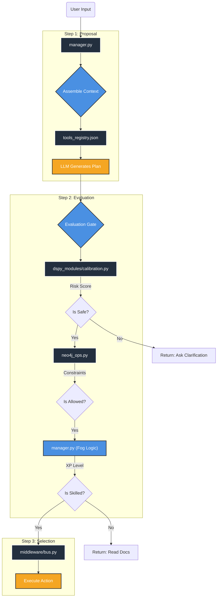

The project structure and the **CoALA (Cognitive Architectures for Language Agents)** model, here is the direct mapping of the theoretical "Proposal" and "Evaluation" steps to your specific code files.

This mapping reveals exactly where the "Thinking" happens inside your `backend/` directory.

|**CoALA Step**|**Theoretical Function**|**Your Project File**|**Specific Function / Logic**|
|---|---|---|---|
|**1. Proposal**|_Generating options/plans based on current state._|**`backend/core/memory/manager.py`**|**The Context Assembler.**      This script constructs the "Context Sandwich." By combining the User Input with available tools (`tools_registry.json`), it sets the stage for the LLM to "Propose" the next move (e.g., "I should read the file").|
|**2. Evaluation**|_Checking the plan against rules, risks, and memory._|**`backend/core/memory/dspy_modules/calibration.py`**|**The Hubris Detector.**      Before acting, this module runs the `CalibrationCheck` signature. It calculates an `ambiguity_score`. If the score is > 0.5, it evaluates the proposal as "Too Risky" and halts execution.|
|**"**|_Checking against Permission/Skill Constraints._|**`backend/db/neo4j_ops.py`**|**The Rule Enforcer.**      This file executes the Cypher queries to fetch `[:MUST_OBEY]` rules. It evaluates if the agent _can_ technically perform the action based on its constraints.|
|**"**|_Checking against Past Experience._|**`backend/db/chroma_ops.py`**|**The History Check.**      Fetches "What Failed" from ChromaDB. If a similar plan failed previously, the evaluation context (System Prompt) is updated to warn against it.|
|**"**|_Checking against Mastery Level._|**`backend/core/memory/manager.py`**|**Fog of War Logic.**      Inside the manager, the code evaluates `if Tool_XP < Required_XP`. If true, the proposal to "Execute Tool" is rejected and replaced with "Read Docs".|
|**3. Selection**|_Choosing the final action to execute._|**`backend/core/middleware/bus.py`**|**The Bus / Executor.**      Once a proposal passes all evaluations, this script actually executes the tool or returns the response to the user.|

---

### 🧩 Visualizing the Code Flow

Here is the flow diagram showing how a single "Thought" moves through your specific files during the CoALA cycle.

---

### 💡 Implementation Takeaway

To strictly adhere to CoALA, ensure that your **`calibration.py` (The Hubris Detector)** runs _after_ the user input but _before_ any tool is actually touched.

- **Wrong Way:** User says "Delete file" -> Agent tries to delete -> Error catches it.
    
- **CoALA Way:** User says "Delete file" -> `calibration.py` sees "Delete" + High Ambiguity -> **Evaluates** as Unsafe -> Agent asks "Which file?" (Proposal rejected).