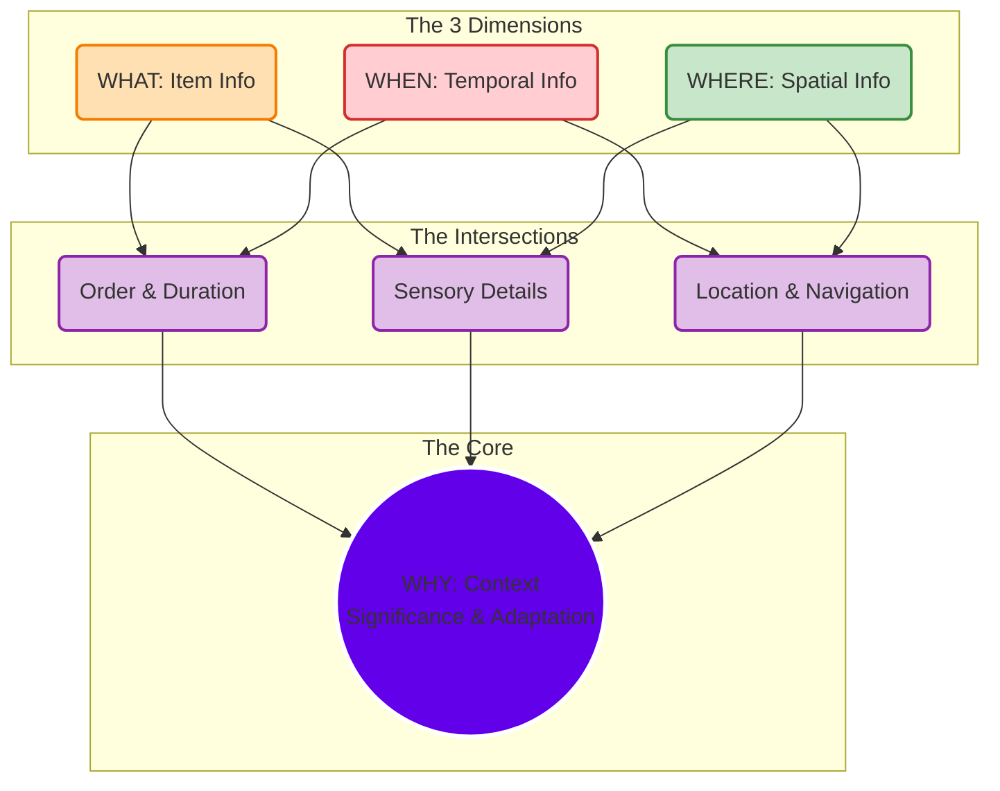

**Goal:** Understand how distinct data dimensions combine to create "Context" and "Significance" in memory.

---

## 🔹 Phase 1: The Raw Dimensions (The Inputs)

**Objective:** Capture the fundamental attributes of an event.

Every memory begins as isolated data points. In an AI context, these are the metadata tags attached to a log.

- **WHAT (Item Info):** The actual content. (e.g., The specific code snippet the user wrote).
    
- **WHEN (Temporal Info):** The timestamp or turn sequence. (e.g., "After the database migration").
    
- **WHERE (Spatial Info):** The environment or state. (e.g., "In the `backend/core` directory").
    

## 🔹 Phase 2: The Associative Links (The Overlaps)

**Objective:** Creating relationships between dimensions.

Data becomes information when these dimensions intersect.

- **Order & Duration (What + When):** Understanding the _sequence_ of events. "The error happened _after_ the deployment."
    
- **Sensory/Perceptual (What + Where):** The _details_ of the environment. "The file was read-only _in this folder_."
    
- **Navigation (When + Where):** Tracking _movement_ through states. "We moved from the testing environment to production _yesterday_."
    

## 🔹 Phase 3: The "Why" (Contextual Synthesis)

**Objective:** Determining Significance.

The intersection of all three circles is the **Context**. This is the "Why." It answers: _Is this memory significant enough to store?_

- **Adaptive Reasons:** Does this help the agent survive/perform better next time?
    
- **Emotional/Cognitive:** Was the user angry? Was the task complex?

---

### 🛠️ Visual Reconstruction

This diagram creates a hierarchy from the raw inputs down to the central core of "Context."

---

### 🔑 Key Takeaway for Your Agent

In your architecture (Phase 1.2 ChromaDB), the **Vector Schema** must capture the "Why." You shouldn't just store the text (The "What"). You must embed the **Context**: _Why_ was this conversation important? (e.g., "User provided a correction to the `tab` rule").