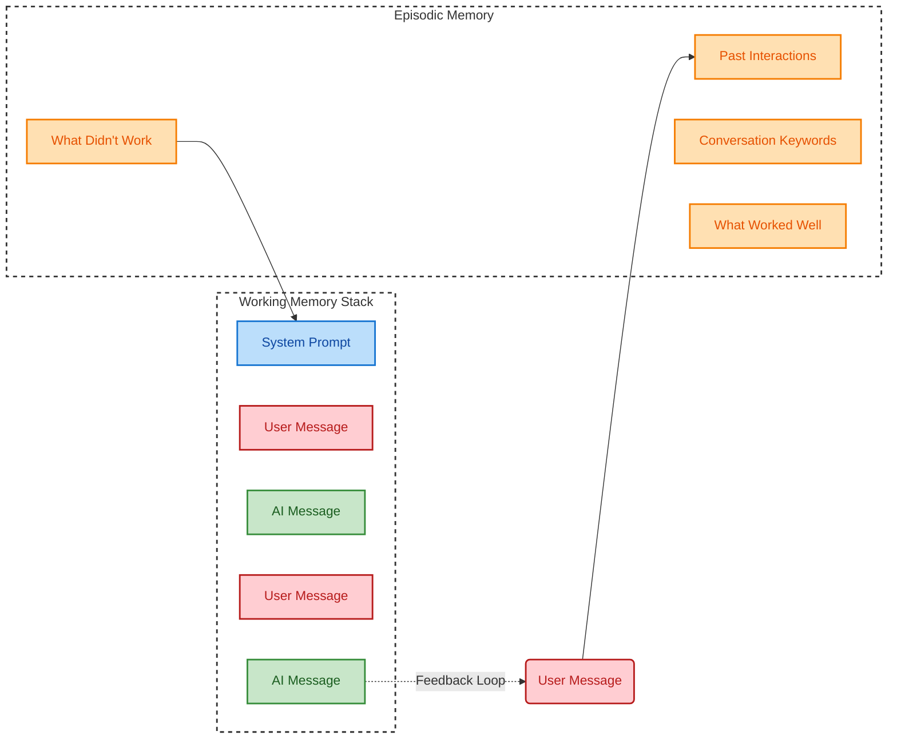

**Goal:** Visualize how a static "System Prompt" becomes dynamic by injecting past experiences.

---

## 🔹 Phase 1: The Retrieval Trigger

**Objective:** Fetch context _before_ processing.

The cycle begins when the **User Message** is received. Instead of going straight to the LLM, the message is first used as a "Search Query" against the **Episodic Memory** database.

- **Input:** User Message (Red).
    
- **The Lookup:** The system scans for four specific data points:
    
    1. **Past Interactions:** "Have we talked about this before?"
        
    2. **Keywords:** "What is the topic?" (e.g., Python, SQL).
        
    3. **What Worked:** Positive reinforcement from previous sessions.
        
    4. **What Didn't Work:** Negative feedback/constraints to apply.
        

## 🔹 Phase 2: The "Prompt Engineering" Step

**Objective:** Behavior modification.

The data retrieved from Phase 1 isn't just appended to the chat; it is used to construct the **System Prompt** (Blue). This is the "God Mode" instruction that tells the AI _how_ to act.

- **Transformation:** The static instruction "You are an AI" becomes "You are an AI who avoids emojis (because that didn't work last time) and focuses on Python (keyword)."
    

## 🔹 Phase 3: Working Memory Assembly

**Objective:** Constructing the Context Window.

Finally, the **Working Memory** (The Stack) is reconstructed from scratch for the inference step. It is built in a specific hierarchy:

1. **The Enriched System Prompt** (Top Priority).
    
2. **Conversation History** (Alternating User/AI messages).
    
3. **The New User Message** (Immediate Context).

---

### 🛠️ Visual Reconstruction

Here is the Mermaid diagram representing this specific logic flow.

---

### 🔑 Key Takeaway

The "Feedback Loop" at the bottom is critical. It implies that every **AI Message** generated at the end of this flow eventually becomes a "Past Interaction" in the Episodic Memory, allowing the agent to get smarter with every single turn.