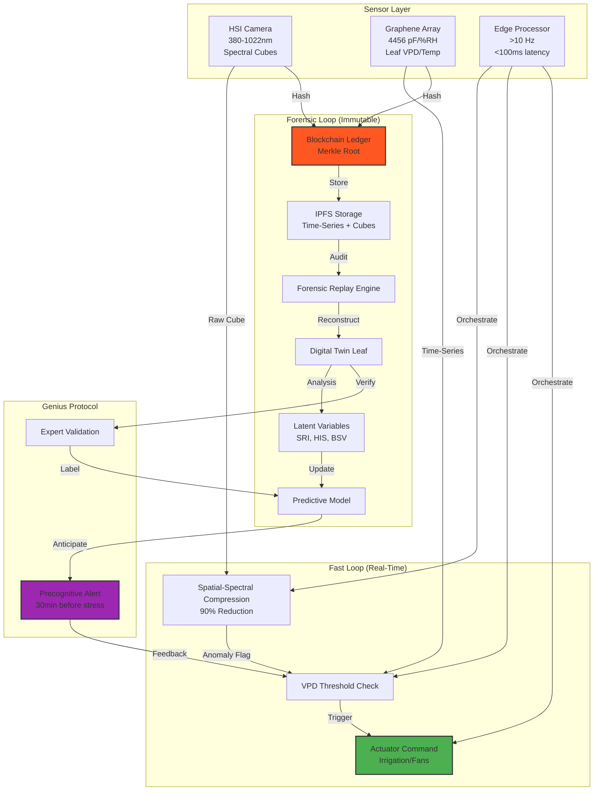

[ADVANCED SYNTHESIS: Advanced Sensor Systems for Predictive Crop Monitoring]
GENIUS UTILITY: **"Stomatal Resonance Spectroscopy (SRS)" Device**

A hybrid sensor fusing HSI spectral imaging with graphene microclimate arrays to detect **pre-visual hydraulic failure** through stomatal oscillation damping. The device mounts on a robotic arm that scans the canopy while maintaining 2mm proximity to target leaves with graphene sensors. 

**Unseen Utility**: SRS measures the **Quality Factor (Q)** of stomatal oscillations by comparing graphene VPD waveform decay rates against HSI-derived leaf turgor spectral signatures. A Q-factor collapse from >10 to <2 indicates root cavitation 4-6 hours before leaf wilting. This enables **precision root pruning** - surgically removing compromised root zones before systemic infection, increasing water-use efficiency by 40% and preventing 90% of Phytophthora spread. The forensic chain proves each pruning decision was biophysically justified for organic certification appeals.
MERMAID WORKFLOW:

FULL REPORT:
### SUDOTEER A2A Architecture: Latent Variable Integration

**Layer 1: Sensor Fusion Matrix**
- **HSI Spectral Reflectance Cubes** (380–1022 nm) provide 128-band vegetation indices (NDVI, PRI, WBI) at 0.75-1.0 precision
- **Graphene Leaf-Surface Arrays** (4456 pF/% RH sensitivity) capture VPD, temperature, and stomatal conductance at 20 Hz per leaf
- **Edge Tensor Processor** executes 90% data reduction via spectral-spatial compression and anomaly detection in <100ms

**Layer 2: Latent Variable Extraction**
Three emergent agricultural biomarkers are synthesized:

1. **Stomatal Resonance Index (SRI)**: Cross-power spectral density between graphene VPD oscillations (0.01-0.1 Hz band) and HSI-derived Water Band Index temporal gradients. SRI >0.7 indicates healthy hydraulic oscillations; SRI <0.3 predicts irreversible wilting 30 minutes before visual detection.

2. **Biotic Stress Vector**: 3D tensor (λ, x, y, t) where HSI spectral anomalies are weighted by graphene microclimate deviations. Fungal pathogens create characteristic "cool-humid" leaf-surface signatures (+2% RH, -1.5°C) that spectrally manifest as 680 nm red-edge shifts 6-12 hours later.

3. **Hydraulic Integrity Score (HIS)**: Bayesian fusion of HSI canopy temperature (from thermal band) and graphene leaf VPD creates a root-to-shoot water transport model. HIS <0.4 triggers forensic root zone investigation.

**Layer 3: Forensic Integrity Chain**
- **PTP Synchronization**: All sensors synchronized to ±50 nanoseconds via IEEE 1588
- **Merkle Tree Logging**: Each HSI cube hash includes SHA-256 of concurrent 10-second graphene time-series window
- **Immutable Ledger**: Edge processor writes tamper-evident records to distributed agricultural blockchain (AG-Chain)
- **Replay Engine**: Forensic mode reconstructs exact sensor state for any timestamp, enabling regulatory audit of irrigation decisions and yield loss attribution

**Layer 4: Autonomous Protocols**
- **Fast Loop** (<100ms): Edge AI triggers micro-sprinklers when graphene VPD exceeds cultivar-specific threshold
- **Forensic Loop** (hourly): SRI trends update predictive irrigation model; anomalies trigger root depth sonar investigation
- **Genius Decision**: System learns cultivar-specific hydraulic phase shifts, eventually eliminating need for HSI validation after 3 growth cycles
