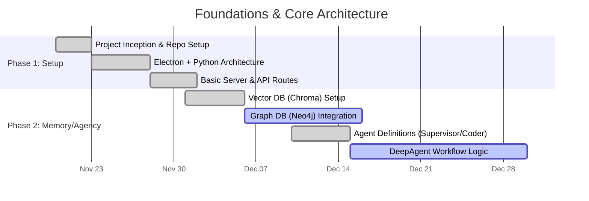
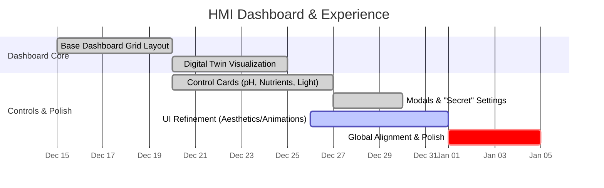
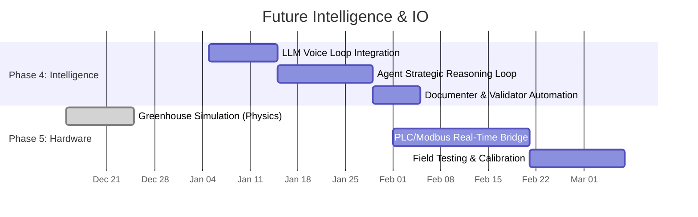

# _SUDOTEER Project Status Report & Gantt Diagram
**Date**: December 28, 2025
**Current Status**: Phase 3 (HMI Refinement & Integration) - Approx. 45% Overall Completion

This report outlines the development lifecycle of the _SUDOTEER Master Grower HMI and Agentic System, mapping progress from 0% (inception) to the current state and projecting the path to 100% (Full Industrial Autonomous Control).

---

## 1. Project Roadmap (Gantt Diagram)

### 1.1 Phase 1 & 2: Project Foundations (Nov - Dec 2025)

### 1.2 Phase 3: HMI & UX Focus (Dec 2025 - Jan 2026)

### 1.3 Phase 4 & 5: Intelligence & Hardware (Jan - Feb 2026)

---

## 2. Module Breakdown & References

The following table maps the visual components to their codebase counterparts and current completion status.

| Domain | Block / Module | Code Reference | Status | Notes |
| :--- | :--- | :--- | :--- | :--- |
| **Frontend** | **HMI Dashboard** | `frontend/views/hmi-dashboard.html` | ✅ 90% | Layout, Cards, and Modals implemented. Pending final alignment polish. |
| | **Control Modals** | `frontend/views/hmi-dashboard.js` | ✅ 100% | Nutrient, pH/Water, and Light Settings with "Secret" Macro Animation completed. |
| | **Animations** | `frontend/views/animations.css` | ✅ 80% | "Swoosh" expansions and Voice Orbs operational. |
| | **CSS Styling** | `frontend/views/hmi-dashboard.css` | 🟡 85% | Needs final global alignment check (As above, so below). |
| **Backend** | **Web Server** | `backend/webserver.py` | ✅ 100% | Serving UI, API, and WebSocket proxies. |
| | **Agent Swarm** | `backend/agents/` | 🟡 40% | Folder structure exists (Architect, Coder, etc.). Logic implementation needed. |
| | **Memory Systems** | `backend/core/memory/` | 🟡 60% | Vector DB ready. Neo4j connectivity in progress. |
| | **Hardware Bridge** | `backend/sandbox/simulations` | 🟡 30% | Simulation logic active. Physical IO pending. |

## 3. Critical Path to 100%

To move from the current state (~45%) to Full Completion, the following bottlenecks must be addressed:

1.  **Intelligence binding**: Connecting the beautiful UI buttons (like "Master Power", "Water Pump") to the *actual* Agent logic that remembers user preferences and context. Currently, they hit simple API endpoints.
2.  **Voice Interaction**: The "Agent Interface" is visually ready (Orbs), but the backend voice-to-text-to-action pipeline needs to be fully wired.
3.  **Cross-Agent Collaboration**: Enabling the 'Architect' to talk to the 'Nutrient' agent to auto-adjust recipes based on sensor data.
4.  **Hardware Handshake**: Replacing the simulation drivers with real Modbus/serial communication scripts for physical PLCs.

## 4. Remaining Work Projection (4-Week Code Plan)

To bridge the gap from **45% to 100%**, we need to implement the "Brain" (Agents) and the "Hands" (Hardware) of the system. The frontend is largely complete; the remaining work is heavy Python backend logic.

| Timeline | Module | Framework / Stack | Scripts to Create | Approx. LOC |
| :--- | :--- | :--- | :--- | :--- |
| **Week 1** | **Voice & Intent Bridge** | **LiveKit / Whisper (Local STT)** Connects the HMI "Orbs" to the backend. Needs a socket loop to stream audio, transcribe it, and classify intent. | `backend/core/voice/bridge.py` `backend/core/voice/transcriber.py` `backend/core/intent_router.py` | **~450 Lines** |
| **Week 2** | **Agent "Cortex" (Logic)** | **DSPy (Declarative Framework)** Moving from "dumb" API endpoints to "smart" agent decisions. The Planner agent needs to read sensors and decide to adjust pH without user clicking buttons. | `backend/agents/architect/core.py` `backend/agents/nutrient/logic.py` `backend/core/memory/recall.py` | **~1,200 Lines** |
| **Week 3** | **Hardware "Handshake"** | **PyModbus / PySerial** Replacing the `simulations/` folder with real drivers. Needs robust error handling, reconnection logic, and state mapping for PLC registers. | `backend/core/hardware/modbus_driver.py` `backend/core/hardware/plc_mapper.py` `backend/core/hardware/safety.py` | **~850 Lines** |
| **Week 4** | **Twin Sync & Validation** | **Neo4j / PyTest** Ensuring the Digital Twin (Graph DB) matches the Physical Twin (Hardware) exactly. "Mirror" logic. | `backend/core/sync_engine.py` `backend/tests/integration_suite.py` `backend/agents/validator/audit.py` | **~600 Lines** |

### Summary of Remaining effort:
*   **Total Time**: ~4 Weeks (Sprints)
*   **Total New Scripts**: ~12 - 15 Files
*   **Approximate New Code**: ~3,100 Lines of Python
*   **Key Challenge**: Transitioning from *Simulation* to *Reality* (Hardware Week).
